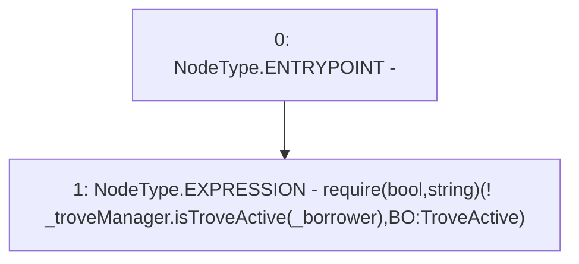

# Context: BorrowerOperationsTester._requireTroveisNotActive

**Contract:** `BorrowerOperationsTester` (Inherits: BorrowerOperations, ReentrancyGuard, IBorrowerOperations, CheckContract, Ownable, LiquityBase, YetiCustomBase, BaseMath, ILiquityBase)
**Signature:** `_requireTroveisNotActive(ITroveManager,address)`
**Method Selector ID:** `Internal (No Method ID)`
**Visibility:** `internal`
**Environment-Free:** `Yes`
**Modifiers:** None

### State Variables Interaction
- **Reads:** None
- **Writes:** None

### Assertion Checks & Business Requirements
- require/assert: `require(bool,string)(! _troveManager.isTroveActive(_borrower),BO:TroveActive)`

### Environment & Verification Flags
- **Uses Foundry Cheatcodes:** No
- **Has Echidna Properties:** No

### Internal Calls Tree
- None

### External Calls / Value Transfers
- `ITroveManager.TMP_1056(bool) = HIGH_LEVEL_CALL, dest:_troveManager(ITroveManager), function:isTroveActive, arguments:['_borrower']  `

### Control Flow Graph (CFG)


### Source Mapping
Declared in: `certora-ac-datasets/detasets/web3bugs/dataset/web3bugs/66/packages/contracts/contracts/BorrowerOperations.sol` on lines **1212** to **1214**

```solidity
    function _requireTroveisNotActive(ITroveManager _troveManager, address _borrower) internal view {
        require(!_troveManager.isTroveActive(_borrower), "BO:TroveActive");
    }

```
