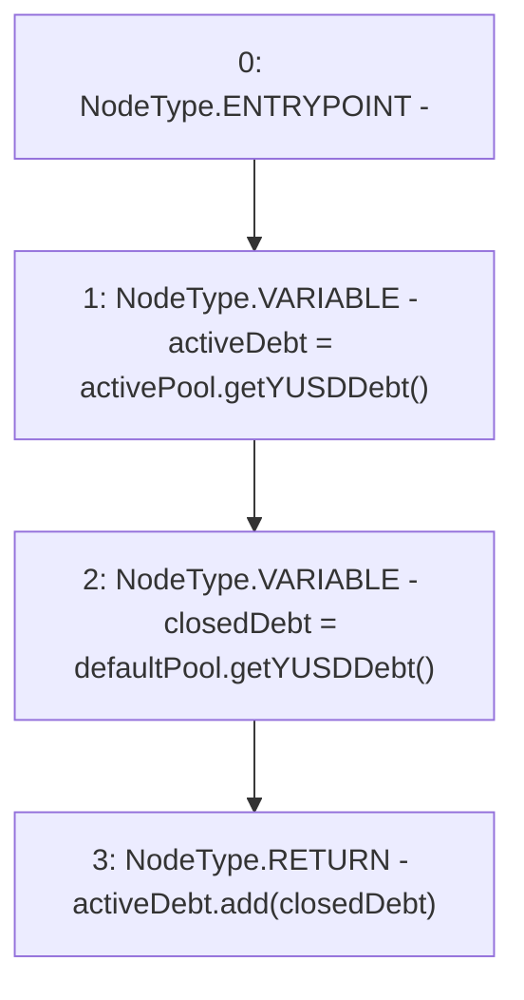

# Context: BorrowerOperationsTester.getEntireSystemDebt

**Contract:** `BorrowerOperationsTester` (Inherits: BorrowerOperations, ReentrancyGuard, IBorrowerOperations, CheckContract, Ownable, LiquityBase, YetiCustomBase, BaseMath, ILiquityBase)
**Signature:** `getEntireSystemDebt() returns (uint256)`
**Method Selector ID:** `0x795d26c3`
**Visibility:** `public`
**Environment-Free:** `Yes`
**Modifiers:** None

### State Variables Interaction
- **Reads:** activePool, defaultPool
- **Writes:** None

### Environment & Verification Flags
- **Uses Foundry Cheatcodes:** No
- **Has Echidna Properties:** No

### Internal Calls Tree
- None

### External Calls / Value Transfers
- `IActivePool.TMP_1137(uint256) = HIGH_LEVEL_CALL, dest:activePool(IActivePool), function:getYUSDDebt, arguments:[]  `
- `SafeMath.TMP_1139(uint256) = LIBRARY_CALL, dest:SafeMath, function:SafeMath.add(uint256,uint256), arguments:['activeDebt', 'closedDebt'] `
- `IDefaultPool.TMP_1138(uint256) = HIGH_LEVEL_CALL, dest:defaultPool(IDefaultPool), function:getYUSDDebt, arguments:[]  `

### Control Flow Graph (CFG)


### Source Mapping
Declared in: `certora-ac-datasets/detasets/web3bugs/dataset/web3bugs/66/packages/contracts/contracts/Dependencies/LiquityBase.sol` on lines **69** to **74**

```solidity
    function getEntireSystemDebt() public override view returns (uint) {
        uint activeDebt = activePool.getYUSDDebt();
        uint closedDebt = defaultPool.getYUSDDebt();

        return activeDebt.add(closedDebt);
    }

```
