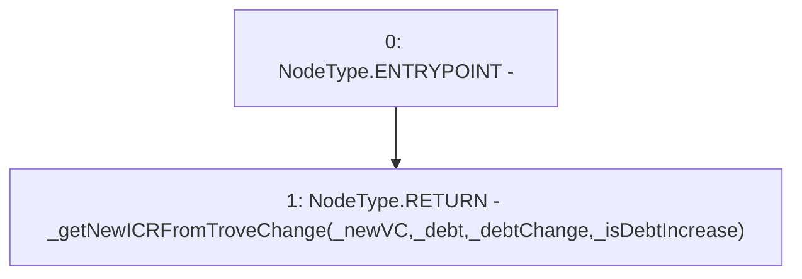

# Context: BorrowerOperationsTester.getNewICRFromTroveChange

**Contract:** `BorrowerOperationsTester` (Inherits: BorrowerOperations, ReentrancyGuard, IBorrowerOperations, CheckContract, Ownable, LiquityBase, YetiCustomBase, BaseMath, ILiquityBase)
**Signature:** `getNewICRFromTroveChange(uint256,uint256,uint256,bool) returns (uint256)`
**Method Selector ID:** `0x23f80085`
**Visibility:** `external`
**Environment-Free:** `Yes`
**Modifiers:** None

### State Variables Interaction
- **Reads:** None
- **Writes:** None

### Environment & Verification Flags
- **Uses Foundry Cheatcodes:** No
- **Has Echidna Properties:** No

### Internal Calls Tree
- None

### External Calls / Value Transfers
- None

### Control Flow Graph (CFG)


### Source Mapping
Declared in: `certora-ac-datasets/detasets/web3bugs/dataset/web3bugs/66/packages/contracts/contracts/TestContracts/BorrowerOperationsTester.sol` on lines **12** to **24**

```solidity
    function getNewICRFromTroveChange
    (
        uint _newVC,
        uint _debt,
        uint _debtChange,
        bool _isDebtIncrease
    ) 
    external
    pure
    returns (uint)
    {
        return _getNewICRFromTroveChange(_newVC, _debt, _debtChange, _isDebtIncrease);
    }

```
