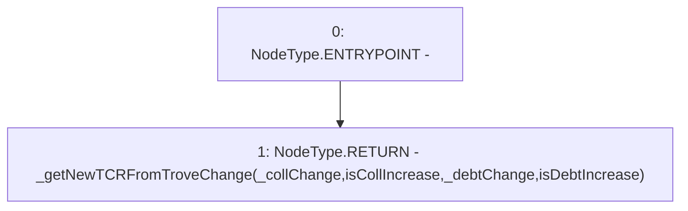

# Context: BorrowerOperationsTester.getNewTCRFromTroveChange

**Contract:** `BorrowerOperationsTester` (Inherits: BorrowerOperations, ReentrancyGuard, IBorrowerOperations, CheckContract, Ownable, LiquityBase, YetiCustomBase, BaseMath, ILiquityBase)
**Signature:** `getNewTCRFromTroveChange(uint256,bool,uint256,bool) returns (uint256)`
**Method Selector ID:** `0xef769d64`
**Visibility:** `external`
**Environment-Free:** `Yes`
**Modifiers:** None

### State Variables Interaction
- **Reads:** None
- **Writes:** None

### Environment & Verification Flags
- **Uses Foundry Cheatcodes:** No
- **Has Echidna Properties:** No

### Internal Calls Tree
- None

### External Calls / Value Transfers
- None

### Control Flow Graph (CFG)


### Source Mapping
Declared in: `certora-ac-datasets/detasets/web3bugs/dataset/web3bugs/66/packages/contracts/contracts/TestContracts/BorrowerOperationsTester.sol` on lines **27** to **39**

```solidity
    function getNewTCRFromTroveChange
    (
        uint _collChange, 
        bool isCollIncrease,  
        uint _debtChange, 
        bool isDebtIncrease
    )
    external 
    view
    returns (uint) 
    {
        return _getNewTCRFromTroveChange(_collChange, isCollIncrease, _debtChange, isDebtIncrease);
    }

```
