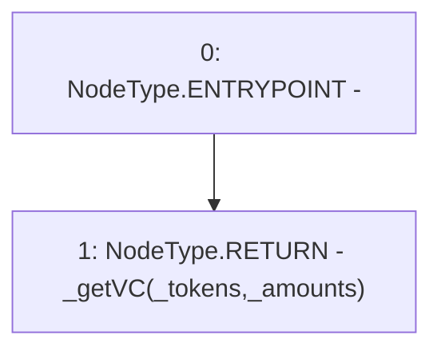

# Context: BorrowerOperationsTester.getVC

**Contract:** `BorrowerOperationsTester` (Inherits: BorrowerOperations, ReentrancyGuard, IBorrowerOperations, CheckContract, Ownable, LiquityBase, YetiCustomBase, BaseMath, ILiquityBase)
**Signature:** `getVC(address[],uint256[]) returns (uint256)`
**Method Selector ID:** `0x0ab06ea4`
**Visibility:** `external`
**Environment-Free:** `Yes`
**Modifiers:** None

### State Variables Interaction
- **Reads:** None
- **Writes:** None

### Environment & Verification Flags
- **Uses Foundry Cheatcodes:** No
- **Has Echidna Properties:** No

### Internal Calls Tree
- None

### External Calls / Value Transfers
- None

### Control Flow Graph (CFG)


### Source Mapping
Declared in: `certora-ac-datasets/detasets/web3bugs/dataset/web3bugs/66/packages/contracts/contracts/TestContracts/BorrowerOperationsTester.sol` on lines **41** to **43**

```solidity
    function getVC(address[] memory _tokens, uint[] memory _amounts) external view returns (uint) {
        return _getVC(_tokens, _amounts);
    }

```
