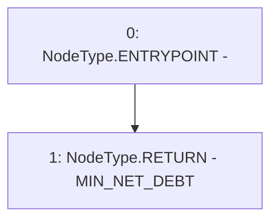

# Context: BorrowerOperationsTester.get_MIN_NET_DEBT

**Contract:** `BorrowerOperationsTester` (Inherits: BorrowerOperations, ReentrancyGuard, IBorrowerOperations, CheckContract, Ownable, LiquityBase, YetiCustomBase, BaseMath, ILiquityBase)
**Signature:** `get_MIN_NET_DEBT() returns (uint256)`
**Method Selector ID:** `0xb7809c4f`
**Visibility:** `external`
**Environment-Free:** `Yes`
**Modifiers:** None

### State Variables Interaction
- **Reads:** MIN_NET_DEBT
- **Writes:** None

### Environment & Verification Flags
- **Uses Foundry Cheatcodes:** No
- **Has Echidna Properties:** No

### Internal Calls Tree
- None

### External Calls / Value Transfers
- None

### Control Flow Graph (CFG)


### Source Mapping
Declared in: `certora-ac-datasets/detasets/web3bugs/dataset/web3bugs/66/packages/contracts/contracts/TestContracts/BorrowerOperationsTester.sol` on lines **52** to **54**

```solidity
    function get_MIN_NET_DEBT() external pure returns (uint) {
        return MIN_NET_DEBT;
    }

```
