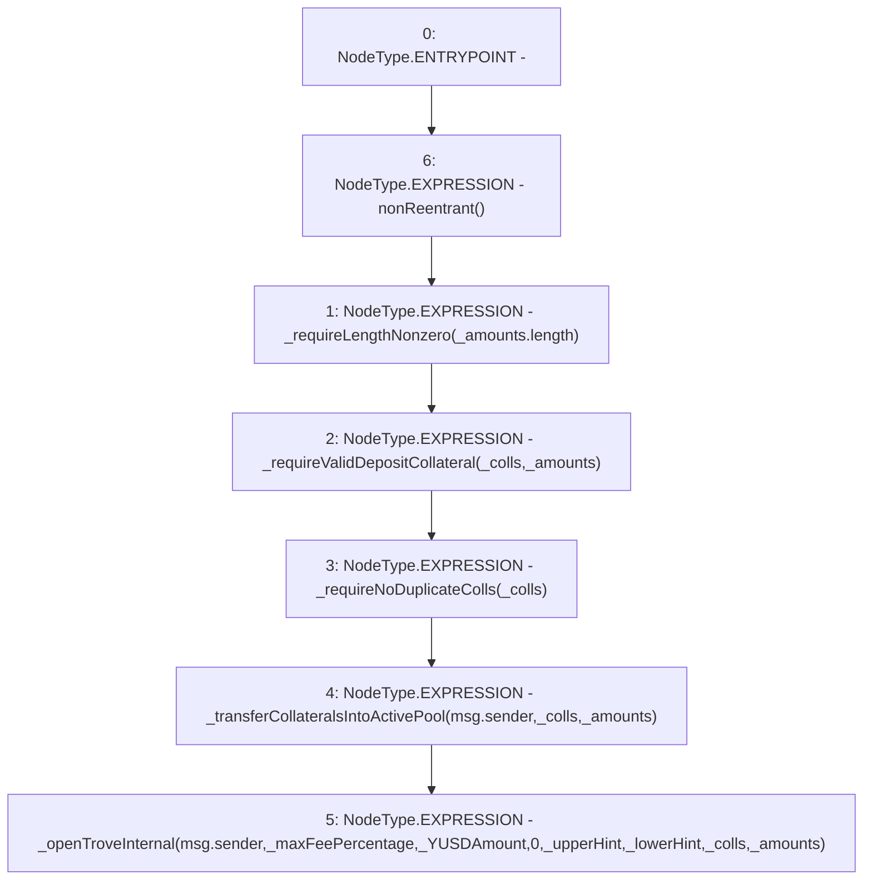

# Context: BorrowerOperationsTester.openTrove

**Contract:** `BorrowerOperationsTester` (Inherits: BorrowerOperations, ReentrancyGuard, IBorrowerOperations, CheckContract, Ownable, LiquityBase, YetiCustomBase, BaseMath, ILiquityBase)
**Signature:** `openTrove(uint256,uint256,address,address,address[],uint256[])`
**Method Selector ID:** `0xfe442cff`
**Visibility:** `external`
**Environment-Free:** `No (reads EVM state context)`
**Modifiers:**
- `nonReentrant`
  ```solidity
  modifier nonReentrant() {
          // On the first call to nonReentrant, _notEntered will be true
          require(_status != _ENTERED, "ReentrancyGuard: reentrant call");
  
          // Any calls to nonReentrant after this point will fail
          _status = _ENTERED;
  
          _;
  
          // By storing the original value once again, a refund is triggered (see
          // https://eips.ethereum.org/EIPS/eip-2200)
          _status = _NOT_ENTERED;
      }
  ```

### State Variables Interaction
- **Reads:** None
- **Writes:** None

### Environment & Verification Flags
- **Uses Foundry Cheatcodes:** No
- **Has Echidna Properties:** No

### Internal Calls Tree
- None

### External Calls / Value Transfers
- None

### Control Flow Graph (CFG)


### Source Mapping
Declared in: `certora-ac-datasets/detasets/web3bugs/dataset/web3bugs/66/packages/contracts/contracts/BorrowerOperations.sol` on lines **225** to **250**

```solidity
    function openTrove(
        uint256 _maxFeePercentage,
        uint256 _YUSDAmount,
        address _upperHint,
        address _lowerHint,
        address[] calldata _colls,
        uint256[] calldata _amounts
    ) external override nonReentrant {
        _requireLengthNonzero(_amounts.length);
        _requireValidDepositCollateral(_colls, _amounts);
        _requireNoDuplicateColls(_colls); // Check that there is no overlap in _colls

        // transfer collateral into ActivePool
        _transferCollateralsIntoActivePool(msg.sender, _colls, _amounts);

        _openTroveInternal(
            msg.sender,
            _maxFeePercentage,
            _YUSDAmount,
            0,
            _upperHint,
            _lowerHint,
            _colls,
            _amounts
        );
    }

```
