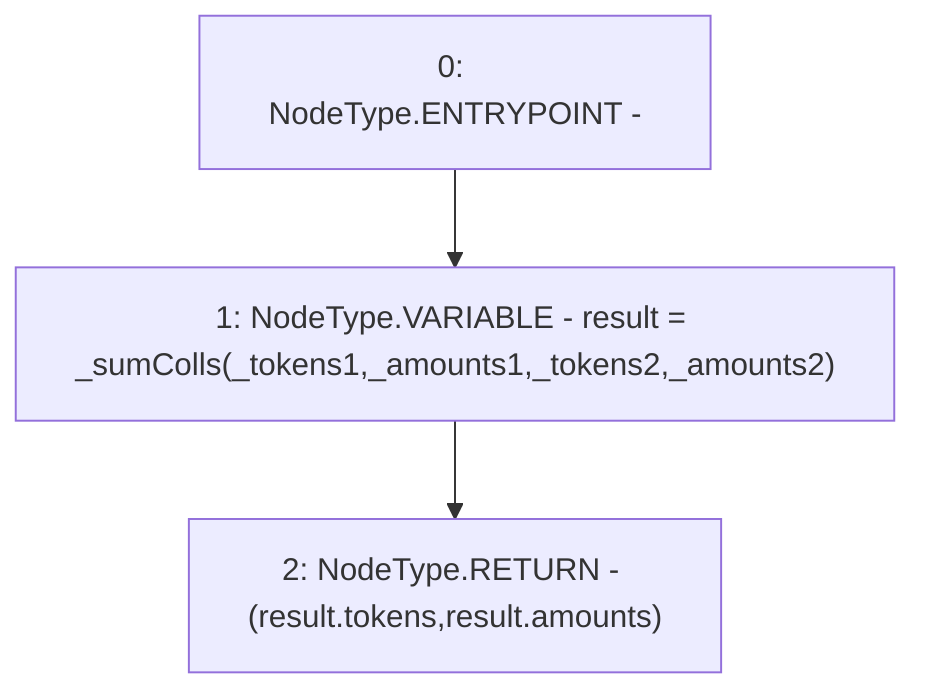

# Context: BorrowerOperationsTester.sumColls

**Contract:** `BorrowerOperationsTester` (Inherits: BorrowerOperations, ReentrancyGuard, IBorrowerOperations, CheckContract, Ownable, LiquityBase, YetiCustomBase, BaseMath, ILiquityBase)
**Signature:** `sumColls(address[],uint256[],address[],uint256[]) returns (address[], uint256[])`
**Method Selector ID:** `0x13555e44`
**Visibility:** `external`
**Environment-Free:** `Yes`
**Modifiers:** None

### State Variables Interaction
- **Reads:** None
- **Writes:** None

### Environment & Verification Flags
- **Uses Foundry Cheatcodes:** No
- **Has Echidna Properties:** No

### Internal Calls Tree
- None

### External Calls / Value Transfers
- None

### Control Flow Graph (CFG)


### Source Mapping
Declared in: `certora-ac-datasets/detasets/web3bugs/dataset/web3bugs/66/packages/contracts/contracts/TestContracts/BorrowerOperationsTester.sol` on lines **45** to **50**

```solidity
    function sumColls(address[] memory _tokens1, uint[] memory _amounts1, 
        address[] memory _tokens2, uint[] memory _amounts2) 
        external view returns (address[] memory, uint[] memory) {
        newColls memory result =  _sumColls(_tokens1, _amounts1, _tokens2, _amounts2);
        return (result.tokens, result.amounts);
    }

```
