# Context: BorrowerOperations._adjustTrove

**Contract:** `BorrowerOperations` (Inherits: ReentrancyGuard, IBorrowerOperations, CheckContract, Ownable, LiquityBase, YetiCustomBase, BaseMath, ILiquityBase)
**Signature:** `_adjustTrove(BorrowerOperations.AdjustTrove_Params)`
**Method Selector ID:** `Internal (No Method ID)`
**Visibility:** `internal`
**Environment-Free:** `No (reads EVM state context)`
**Modifiers:** None

### State Variables Interaction
- **Reads:** DECIMAL_PRECISION, activePool, sortedTroves, troveManager, yusdToken
- **Writes:** None

### Environment & Verification Flags
- **Uses Foundry Cheatcodes:** No
- **Has Echidna Properties:** No

### Internal Calls Tree
- None

### External Calls / Value Transfers
- `SafeMath.TMP_272(uint256) = LIBRARY_CALL, dest:SafeMath, function:SafeMath.sub(uint256,uint256), arguments:['REF_355', 'REF_357'] `
- `SafeMath.TMP_304(uint256) = LIBRARY_CALL, dest:SafeMath, function:SafeMath.sub(uint256,uint256), arguments:['REF_442', 'REF_444'] `
- `ITroveManager.TMP_274(uint256) = HIGH_LEVEL_CALL, dest:REF_363(ITroveManager), function:getTroveDebt, arguments:['msg.sender']  `
- `SafeMath.TMP_267(uint256) = LIBRARY_CALL, dest:SafeMath, function:SafeMath.sub(uint256,uint256), arguments:['REF_321', 'TMP_266'] `
- `SafeMath.TMP_278(uint256) = LIBRARY_CALL, dest:SafeMath, function:SafeMath.add(uint256,uint256), arguments:['REF_379', 'REF_381'] `
- `IActivePool.HIGH_LEVEL_CALL, dest:REF_401(IActivePool), function:receiveCollateral, arguments:['REF_403', 'REF_404']  `
- `SafeMath.TMP_265(uint256) = LIBRARY_CALL, dest:SafeMath, function:SafeMath.mul(uint256,uint256), arguments:['REF_323', 'DECIMAL_PRECISION'] `
- `ISortedTroves.HIGH_LEVEL_CALL, dest:sortedTroves(ISortedTroves), function:reInsert, arguments:['msg.sender', 'REF_417', 'REF_418', 'REF_419']  `
- `LiquityMath.TMP_277(uint256) = LIBRARY_CALL, dest:LiquityMath, function:LiquityMath._computeCR(uint256,uint256), arguments:['REF_376', 'REF_377'] `
- `LiquityMath.TMP_261(uint256) = LIBRARY_CALL, dest:LiquityMath, function:LiquityMath._max(uint256,uint256), arguments:['REF_309', 'REF_310'] `
- `SafeMath.TMP_268(uint256) = LIBRARY_CALL, dest:SafeMath, function:SafeMath.add(uint256,uint256), arguments:['REF_328', 'REF_330'] `
- `ITroveManager.HIGH_LEVEL_CALL, dest:REF_296(ITroveManager), function:applyPendingRewards, arguments:['msg.sender']  `
- `SafeMath.TMP_273(uint256) = LIBRARY_CALL, dest:SafeMath, function:SafeMath.sub(uint256,uint256), arguments:['REF_359', 'REF_361'] `
- `ITroveManager.HIGH_LEVEL_CALL, dest:REF_414(ITroveManager), function:updateStakeAndTotalStakes, arguments:['msg.sender']  `
- `IActivePool.TMP_307(bool) = HIGH_LEVEL_CALL, dest:activePool(IActivePool), function:sendCollateralsUnwrap, arguments:['msg.sender', 'msg.sender', 'REF_451', 'REF_452']  `
- `SafeMath.TMP_266(uint256) = LIBRARY_CALL, dest:SafeMath, function:SafeMath.div(uint256,uint256), arguments:['TMP_265', 'REF_326'] `
- `ITroveManager.TUPLE_2(address[],uint256[]) = HIGH_LEVEL_CALL, dest:REF_333(ITroveManager), function:getTroveColls, arguments:['msg.sender']  `
- `SafeMath.TMP_299(uint256) = LIBRARY_CALL, dest:SafeMath, function:SafeMath.sub(uint256,uint256), arguments:['TMP_298', 'REF_432'] `
- `SafeMath.TMP_287(uint256) = LIBRARY_CALL, dest:SafeMath, function:SafeMath.sub(uint256,uint256), arguments:['TMP_286', 'REF_394'] `

### Control Flow Graph (CFG)

```mermaid
flowchart TD
    Node_0["0: NodeType.ENTRYPOINT - "]
    Node_0 --> Node_1
    Node_1["1: NodeType.VARIABLE - contractsCache = ContractsCache(troveManager,activePool,yusdToken)"]
    Node_1 --> Node_2
    Node_2["2: NodeType.VARIABLE - "]
    Node_2 --> Node_3
    Node_3["3: NodeType.VARIABLE - isRecoveryMode = _checkRecoveryMode()"]
    Node_3 --> Node_4
    Node_4["4: NodeType.IF - params._isDebtIncrease"]
    Node_4 --> Node_5
    Node_4 --> Node_7
    Node_5["5: NodeType.EXPRESSION - _requireValidMaxFeePercentage(params._maxFeePercentage,isRecoveryMode)"]
    Node_5 --> Node_6
    Node_6["6: NodeType.EXPRESSION - _requireNonZeroDebtChange(params._YUSDChange)"]
    Node_6 --> Node_7
    Node_7["7: NodeType.ENDIF - "]
    Node_7 --> Node_8
    Node_8["8: NodeType.EXPRESSION - _requireNonZeroAdjustment(params._amountsIn,params._amountsOut,params._YUSDChange)"]
    Node_8 --> Node_9
    Node_9["9: NodeType.EXPRESSION - _requireTroveisActive(contractsCache.troveManager,msg.sender)"]
    Node_9 --> Node_10
    Node_10["10: NodeType.EXPRESSION - contractsCache.troveManager.applyPendingRewards(msg.sender)"]
    Node_10 --> Node_11
    Node_11["11: NodeType.EXPRESSION - vars.netDebtChange = params._YUSDChange"]
    Node_11 --> Node_12
    Node_12["12: NodeType.EXPRESSION - vars.VCin = _getVC(params._collsIn,params._amountsIn)"]
    Node_12 --> Node_13
    Node_13["13: NodeType.EXPRESSION - vars.VCout = _getVC(params._collsOut,params._amountsOut)"]
    Node_13 --> Node_14
    Node_14["14: NodeType.IF - params._isDebtIncrease"]
    Node_14 --> Node_15
    Node_14 --> Node_16
    Node_15["15: NodeType.EXPRESSION - vars.maxFeePercentageFactor = LiquityMath._max(vars.VCin,params._YUSDChange)"]
    Node_15 --> Node_17
    Node_16["16: NodeType.EXPRESSION - vars.maxFeePercentageFactor = vars.VCin"]
    Node_16 --> Node_17
    Node_17["17: NodeType.ENDIF - "]
    Node_17 --> Node_18
    Node_18["18: NodeType.IF - params._isDebtIncrease && ! isRecoveryMode"]
    Node_18 --> Node_19
    Node_18 --> Node_22
    Node_19["19: NodeType.EXPRESSION - vars.YUSDFee = _triggerBorrowingFee(contractsCache.troveManager,contractsCache.yusdToken,params._YUSDChange,vars.maxFeePercentageFactor,params._maxFeePercentage)"]
    Node_19 --> Node_20
    Node_20["20: NodeType.EXPRESSION - params._maxFeePercentage = params._maxFeePercentage.sub(vars.YUSDFee.mul(DECIMAL_PRECISION).div(vars.maxFeePercentageFactor))"]
    Node_20 --> Node_21
    Node_21["21: NodeType.EXPRESSION - vars.netDebtChange = vars.netDebtChange.add(vars.YUSDFee)"]
    Node_21 --> Node_22
    Node_22["22: NodeType.ENDIF - "]
    Node_22 --> Node_23
    Node_23["23: NodeType.EXPRESSION - (vars.currAssets,vars.currAmounts) = contractsCache.troveManager.getTroveColls(msg.sender)"]
    Node_23 --> Node_24
    Node_24["24: NodeType.EXPRESSION - vars.currVC = _getVC(vars.currAssets,vars.currAmounts)"]
    Node_24 --> Node_25
    Node_25["25: NodeType.EXPRESSION - (vars.newAssets,vars.newAmounts) = _getNewPortfolio(vars.currAssets,vars.currAmounts,params._collsIn,params._amountsIn,params._collsOut,params._amountsOut)"]
    Node_25 --> Node_26
    Node_26["26: NodeType.EXPRESSION - vars.newVC = _getVC(vars.newAssets,vars.newAmounts)"]
    Node_26 --> Node_27
    Node_27["27: NodeType.EXPRESSION - vars.isCollIncrease = vars.newVC > vars.currVC"]
    Node_27 --> Node_28
    Node_28["28: NodeType.EXPRESSION - vars.collChange = 0"]
    Node_28 --> Node_29
    Node_29["29: NodeType.IF - vars.isCollIncrease"]
    Node_29 --> Node_30
    Node_29 --> Node_31
    Node_30["30: NodeType.EXPRESSION - vars.collChange = (vars.newVC).sub(vars.currVC)"]
    Node_30 --> Node_32
    Node_31["31: NodeType.EXPRESSION - vars.collChange = (vars.currVC).sub(vars.newVC)"]
    Node_31 --> Node_32
    Node_32["32: NodeType.ENDIF - "]
    Node_32 --> Node_33
    Node_33["33: NodeType.EXPRESSION - vars.debt = contractsCache.troveManager.getTroveDebt(msg.sender)"]
    Node_33 --> Node_34
    Node_34["34: NodeType.IF - params._collsIn.length != 0"]
    Node_34 --> Node_35
    Node_34 --> Node_36
    Node_35["35: NodeType.EXPRESSION - vars.variableYUSDFee = _getTotalVariableDepositFee(params._collsIn,params._amountsIn,vars.VCin,vars.VCout,vars.maxFeePercentageFactor,params._maxFeePercentage,contractsCache)"]
    Node_35 --> Node_36
    Node_36["36: NodeType.ENDIF - "]
    Node_36 --> Node_37
    Node_37["37: NodeType.EXPRESSION - vars.oldICR = LiquityMath._computeCR(vars.currVC,vars.debt)"]
    Node_37 --> Node_38
    Node_38["38: NodeType.EXPRESSION - vars.debt = vars.debt.add(vars.variableYUSDFee)"]
    Node_38 --> Node_39
    Node_39["39: NodeType.EXPRESSION - vars.newICR = _getNewICRFromTroveChange(vars.newVC,vars.debt,vars.netDebtChange,params._isDebtIncrease)"]
    Node_39 --> Node_40
    Node_40["40: NodeType.EXPRESSION - _requireValidAdjustmentInCurrentMode(isRecoveryMode,params._amountsOut,params._isDebtIncrease,vars)"]
    Node_40 --> Node_41
    Node_41["41: NodeType.IF - ! params._isUnlever && ! params._isDebtIncrease && params._YUSDChange != 0"]
    Node_41 --> Node_42
    Node_41 --> Node_45
    Node_42["42: NodeType.EXPRESSION - _requireAtLeastMinNetDebt(_getNetDebt(vars.debt).sub(vars.netDebtChange))"]
    Node_42 --> Node_43
    Node_43["43: NodeType.EXPRESSION - _requireValidYUSDRepayment(vars.debt,vars.netDebtChange)"]
    Node_43 --> Node_44
    Node_44["44: NodeType.EXPRESSION - _requireSufficientYUSDBalance(contractsCache.yusdToken,msg.sender,vars.netDebtChange)"]
    Node_44 --> Node_45
    Node_45["45: NodeType.ENDIF - "]
    Node_45 --> Node_46
    Node_46["46: NodeType.IF - params._collsIn.length != 0"]
    Node_46 --> Node_47
    Node_46 --> Node_48
    Node_47["47: NodeType.EXPRESSION - contractsCache.activePool.receiveCollateral(params._collsIn,params._amountsIn)"]
    Node_47 --> Node_48
    Node_48["48: NodeType.ENDIF - "]
    Node_48 --> Node_49
    Node_49["49: NodeType.EXPRESSION - (vars.newVC,vars.newDebt) = _updateTroveFromAdjustment(contractsCache.troveManager,msg.sender,vars.newAssets,vars.newAmounts,vars.newVC,vars.netDebtChange,params._isDebtIncrease,vars.variableYUSDFee)"]
    Node_49 --> Node_50
    Node_50["50: NodeType.EXPRESSION - contractsCache.troveManager.updateStakeAndTotalStakes(msg.sender)"]
    Node_50 --> Node_51
    Node_51["51: NodeType.EXPRESSION - sortedTroves.reInsert(msg.sender,vars.newICR,params._upperHint,params._lowerHint)"]
    Node_51 --> Node_52
    Node_52["52: NodeType.EXPRESSION - TroveUpdated(msg.sender,vars.newDebt,vars.newAssets,vars.newAmounts,BorrowerOperation.adjustTrove)"]
    Node_52 --> Node_53
    Node_53["53: NodeType.EXPRESSION - YUSDBorrowingFeePaid(msg.sender,vars.YUSDFee)"]
    Node_53 --> Node_54
    Node_54["54: NodeType.IF - params._isUnlever"]
    Node_54 --> Node_55
    Node_54 --> Node_60
    Node_55["55: NodeType.EXPRESSION - _unleverColls(contractsCache.activePool,params._collsOut,params._amountsOut,params._maxSlippages)"]
    Node_55 --> Node_56
    Node_56["56: NodeType.EXPRESSION - _requireAtLeastMinNetDebt(_getNetDebt(vars.debt).sub(params._YUSDChange))"]
    Node_56 --> Node_57
    Node_57["57: NodeType.EXPRESSION - _requireValidYUSDRepayment(vars.debt,params._YUSDChange)"]
    Node_57 --> Node_58
    Node_58["58: NodeType.EXPRESSION - _requireSufficientYUSDBalance(contractsCache.yusdToken,msg.sender,params._YUSDChange)"]
    Node_58 --> Node_59
    Node_59["59: NodeType.EXPRESSION - _repayYUSD(contractsCache.activePool,contractsCache.yusdToken,msg.sender,params._YUSDChange)"]
    Node_59 --> Node_63
    Node_60["60: NodeType.EXPRESSION - _moveYUSD(contractsCache.activePool,contractsCache.yusdToken,msg.sender,params._YUSDChange.sub(params._totalYUSDDebtFromLever),params._isDebtIncrease,vars.netDebtChange)"]
    Node_60 --> Node_61
    Node_61["61: NodeType.EXPRESSION - _withdrawYUSD(contractsCache.activePool,contractsCache.yusdToken,msg.sender,0,vars.variableYUSDFee)"]
    Node_61 --> Node_62
    Node_62["62: NodeType.EXPRESSION - activePool.sendCollateralsUnwrap(msg.sender,msg.sender,params._collsOut,params._amountsOut)"]
    Node_62 --> Node_63
    Node_63["63: NodeType.ENDIF - "]
```


### Source Mapping
Declared in: `certora-ac-datasets/detasets/web3bugs/dataset/web3bugs/66/packages/contracts/contracts/BorrowerOperations.sol` on lines **635** to **804**

```solidity
    function _adjustTrove(AdjustTrove_Params memory params) internal {
        ContractsCache memory contractsCache = ContractsCache(troveManager, activePool, yusdToken);
        LocalVariables_adjustTrove memory vars;

        bool isRecoveryMode = _checkRecoveryMode();

        if (params._isDebtIncrease) {
            _requireValidMaxFeePercentage(params._maxFeePercentage, isRecoveryMode);
            _requireNonZeroDebtChange(params._YUSDChange);
        }

        // Checks that at least one array is non-empty, and also that at least one value is 1. 
        _requireNonZeroAdjustment(params._amountsIn, params._amountsOut, params._YUSDChange);
        _requireTroveisActive(contractsCache.troveManager, msg.sender);

        contractsCache.troveManager.applyPendingRewards(msg.sender);
        vars.netDebtChange = params._YUSDChange;

        vars.VCin = _getVC(params._collsIn, params._amountsIn);
        vars.VCout = _getVC(params._collsOut, params._amountsOut);

        if (params._isDebtIncrease) {
            vars.maxFeePercentageFactor = LiquityMath._max(vars.VCin, params._YUSDChange);
        } else {
            vars.maxFeePercentageFactor = vars.VCin;
        }
        
        // If the adjustment incorporates a debt increase and system is in Normal Mode, then trigger a borrowing fee
        if (params._isDebtIncrease && !isRecoveryMode) {
            vars.YUSDFee = _triggerBorrowingFee(
                contractsCache.troveManager,
                contractsCache.yusdToken,
                params._YUSDChange,
                vars.maxFeePercentageFactor, // max of VC in and YUSD change here to see what the max borrowing fee is triggered on.
                params._maxFeePercentage
            );
            // passed in max fee minus actual fee percent applied so far
            params._maxFeePercentage = params._maxFeePercentage.sub(vars.YUSDFee.mul(DECIMAL_PRECISION).div(vars.maxFeePercentageFactor)); 
            vars.netDebtChange = vars.netDebtChange.add(vars.YUSDFee); // The raw debt change includes the fee
        }

        // get current portfolio in trove
        (vars.currAssets, vars.currAmounts) = contractsCache.troveManager.getTroveColls(msg.sender);
        // current VC based on current portfolio and latest prices
        vars.currVC = _getVC(vars.currAssets, vars.currAmounts);

        // get new portfolio in trove after changes. Will error if invalid changes:
        (vars.newAssets, vars.newAmounts) = _getNewPortfolio(
            vars.currAssets,
            vars.currAmounts,
            params._collsIn,
            params._amountsIn,
            params._collsOut,
            params._amountsOut
        );
        // new VC based on new portfolio and latest prices
        vars.newVC = _getVC(vars.newAssets, vars.newAmounts);

        vars.isCollIncrease = vars.newVC > vars.currVC;
        vars.collChange = 0;
        if (vars.isCollIncrease) {
            vars.collChange = (vars.newVC).sub(vars.currVC);
        } else {
            vars.collChange = (vars.currVC).sub(vars.newVC);
        }

        vars.debt = contractsCache.troveManager.getTroveDebt(msg.sender);

        if (params._collsIn.length != 0) {
            vars.variableYUSDFee = _getTotalVariableDepositFee(
                    params._collsIn,
                    params._amountsIn,
                    vars.VCin,
                    vars.VCout,
                    vars.maxFeePercentageFactor,
                    params._maxFeePercentage,
                    contractsCache
            );
        }

        // Get the trove's old ICR before the adjustment, and what its new ICR will be after the adjustment
        vars.oldICR = LiquityMath._computeCR(vars.currVC, vars.debt);

        vars.debt = vars.debt.add(vars.variableYUSDFee); 

        vars.newICR = _getNewICRFromTroveChange(vars.newVC,
            vars.debt, // with variableYUSDFee already added. 
            vars.netDebtChange,
            params._isDebtIncrease 
        );

        // Check the adjustment satisfies all conditions for the current system mode
        _requireValidAdjustmentInCurrentMode(
            isRecoveryMode,
            params._amountsOut,
            params._isDebtIncrease,
            vars
        );

        // When the adjustment is a debt repayment, check it's a valid amount and that the caller has enough YUSD
        if (!params._isUnlever && !params._isDebtIncrease && params._YUSDChange != 0) {
            _requireAtLeastMinNetDebt(_getNetDebt(vars.debt).sub(vars.netDebtChange));
            _requireValidYUSDRepayment(vars.debt, vars.netDebtChange);
            _requireSufficientYUSDBalance(contractsCache.yusdToken, msg.sender, vars.netDebtChange);
        }

        if (params._collsIn.length != 0) {
            contractsCache.activePool.receiveCollateral(params._collsIn, params._amountsIn);
        }

        (vars.newVC, vars.newDebt) = _updateTroveFromAdjustment(
            contractsCache.troveManager,
            msg.sender,
            vars.newAssets,
            vars.newAmounts,
            vars.newVC,
            vars.netDebtChange,
            params._isDebtIncrease, 
            vars.variableYUSDFee
        );

        contractsCache.troveManager.updateStakeAndTotalStakes(msg.sender);

        // Re-insert trove in to the sorted list
        sortedTroves.reInsert(msg.sender, vars.newICR, params._upperHint, params._lowerHint);

        emit TroveUpdated(
            msg.sender,
            vars.newDebt,
            vars.newAssets,
            vars.newAmounts,
            BorrowerOperation.adjustTrove
        );
        emit YUSDBorrowingFeePaid(msg.sender, vars.YUSDFee);

        // in case of unlever up
        if (params._isUnlever) {
            // 1. Withdraw the collateral from active pool and perform swap using single unlever up and corresponding router. 
            _unleverColls(contractsCache.activePool, params._collsOut, params._amountsOut, params._maxSlippages);

            // 2. update the trove with the new collateral and debt, repaying the total amount of YUSD specified. 
            // if not enough coll sold for YUSD, must cover from user balance
            _requireAtLeastMinNetDebt(_getNetDebt(vars.debt).sub(params._YUSDChange));
            _requireValidYUSDRepayment(vars.debt, params._YUSDChange);
            _requireSufficientYUSDBalance(contractsCache.yusdToken, msg.sender, params._YUSDChange);
            _repayYUSD(contractsCache.activePool, contractsCache.yusdToken, msg.sender, params._YUSDChange);
        } else {
            // Use the unmodified _YUSDChange here, as we don't send the fee to the user
            _moveYUSD(
                contractsCache.activePool,
                contractsCache.yusdToken,
                msg.sender,
                params._YUSDChange.sub(params._totalYUSDDebtFromLever), // 0 in non lever case
                params._isDebtIncrease,
                vars.netDebtChange
            );

            // Additionally move the variable deposit fee to the active pool manually, as it is always an increase in debt
            _withdrawYUSD(
                contractsCache.activePool,
                contractsCache.yusdToken,
                msg.sender,
                0,
                vars.variableYUSDFee
            );

            // transfer withdrawn collateral to msg.sender from ActivePool
            activePool.sendCollateralsUnwrap(msg.sender, msg.sender, params._collsOut, params._amountsOut);
        }
    }

```
