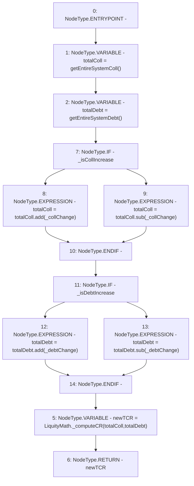

# Context: BorrowerOperations._getNewTCRFromTroveChange

**Contract:** `BorrowerOperations` (Inherits: ReentrancyGuard, IBorrowerOperations, CheckContract, Ownable, LiquityBase, YetiCustomBase, BaseMath, ILiquityBase)
**Signature:** `_getNewTCRFromTroveChange(uint256,bool,uint256,bool) returns (uint256)`
**Method Selector ID:** `Internal (No Method ID)`
**Visibility:** `internal`
**Environment-Free:** `Yes`
**Modifiers:** None

### State Variables Interaction
- **Reads:** None
- **Writes:** None

### Environment & Verification Flags
- **Uses Foundry Cheatcodes:** No
- **Has Echidna Properties:** No

### Internal Calls Tree
- None

### External Calls / Value Transfers
- `SafeMath.TMP_498(uint256) = LIBRARY_CALL, dest:SafeMath, function:SafeMath.add(uint256,uint256), arguments:['totalDebt', '_debtChange'] `
- `LiquityMath.TMP_495(uint256) = LIBRARY_CALL, dest:LiquityMath, function:LiquityMath._computeCR(uint256,uint256), arguments:['totalColl', 'totalDebt'] `
- `SafeMath.TMP_499(uint256) = LIBRARY_CALL, dest:SafeMath, function:SafeMath.sub(uint256,uint256), arguments:['totalDebt', '_debtChange'] `
- `SafeMath.TMP_496(uint256) = LIBRARY_CALL, dest:SafeMath, function:SafeMath.add(uint256,uint256), arguments:['totalColl', '_collChange'] `
- `SafeMath.TMP_497(uint256) = LIBRARY_CALL, dest:SafeMath, function:SafeMath.sub(uint256,uint256), arguments:['totalColl', '_collChange'] `

### Control Flow Graph (CFG)


### Source Mapping
Declared in: `certora-ac-datasets/detasets/web3bugs/dataset/web3bugs/66/packages/contracts/contracts/BorrowerOperations.sol` on lines **1398** to **1412**

```solidity
    function _getNewTCRFromTroveChange(
        uint256 _collChange,
        bool _isCollIncrease,
        uint256 _debtChange,
        bool _isDebtIncrease
    ) internal view returns (uint256) {
        uint256 totalColl = getEntireSystemColl();
        uint256 totalDebt = getEntireSystemDebt();

        totalColl = _isCollIncrease ? totalColl.add(_collChange) : totalColl.sub(_collChange);
        totalDebt = _isDebtIncrease ? totalDebt.add(_debtChange) : totalDebt.sub(_debtChange);

        uint256 newTCR = LiquityMath._computeCR(totalColl, totalDebt);
        return newTCR;
    }

```
