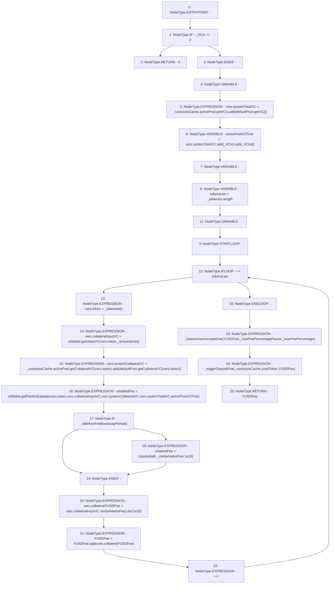

# Context: BorrowerOperations._getTotalVariableDepositFee

**Contract:** `BorrowerOperations` (Inherits: ReentrancyGuard, IBorrowerOperations, CheckContract, Ownable, LiquityBase, YetiCustomBase, BaseMath, ILiquityBase)
**Signature:** `_getTotalVariableDepositFee(address[],uint256[],uint256,uint256,uint256,uint256,BorrowerOperations.ContractsCache) returns (uint256)`
**Method Selector ID:** `Internal (No Method ID)`
**Visibility:** `internal`
**Environment-Free:** `No (reads EVM state context)`
**Modifiers:** None

### State Variables Interaction
- **Reads:** defaultPool, whitelist
- **Writes:** None

### Environment & Verification Flags
- **Uses Foundry Cheatcodes:** No
- **Has Echidna Properties:** No

### Internal Calls Tree
- None

### External Calls / Value Transfers
- `LiquityMath.TMP_379(uint256) = LIBRARY_CALL, dest:LiquityMath, function:LiquityMath._min(uint256,uint256), arguments:['whitelistFee', '10000000000000000'] `
- `SafeMath.TMP_380(uint256) = LIBRARY_CALL, dest:SafeMath, function:SafeMath.mul(uint256,uint256), arguments:['REF_540', 'whitelistFee'] `
- `IActivePool.TMP_367(uint256) = HIGH_LEVEL_CALL, dest:REF_512(IActivePool), function:getVC, arguments:[]  `
- `IWhitelist.TMP_377(uint256) = HIGH_LEVEL_CALL, dest:whitelist(IWhitelist), function:getFeeAndUpdate, arguments:['REF_534', 'REF_535', 'REF_536', 'REF_537', 'activePoolVCPost']  `
- `SafeMath.TMP_370(uint256) = LIBRARY_CALL, dest:SafeMath, function:SafeMath.add(uint256,uint256), arguments:['REF_516', '_VCin'] `
- `SafeMath.TMP_382(uint256) = LIBRARY_CALL, dest:SafeMath, function:SafeMath.add(uint256,uint256), arguments:['YUSDFee', 'REF_544'] `
- `SafeMath.TMP_371(uint256) = LIBRARY_CALL, dest:SafeMath, function:SafeMath.sub(uint256,uint256), arguments:['TMP_370', '_VCout'] `
- `IWhitelist.TMP_373(uint256) = HIGH_LEVEL_CALL, dest:whitelist(IWhitelist), function:getValueVC, arguments:['REF_524', 'REF_525']  `
- `SafeMath.TMP_369(uint256) = LIBRARY_CALL, dest:SafeMath, function:SafeMath.add(uint256,uint256), arguments:['TMP_367', 'TMP_368'] `
- `IActivePool.TMP_374(uint256) = HIGH_LEVEL_CALL, dest:REF_527(IActivePool), function:getCollateralVC, arguments:['REF_529']  `
- `IDefaultPool.TMP_368(uint256) = HIGH_LEVEL_CALL, dest:defaultPool(IDefaultPool), function:getVC, arguments:[]  `
- `IDefaultPool.TMP_375(uint256) = HIGH_LEVEL_CALL, dest:defaultPool(IDefaultPool), function:getCollateralVC, arguments:['REF_532']  `
- `SafeMath.TMP_381(uint256) = LIBRARY_CALL, dest:SafeMath, function:SafeMath.div(uint256,uint256), arguments:['TMP_380', '1000000000000000000'] `
- `SafeMath.TMP_376(uint256) = LIBRARY_CALL, dest:SafeMath, function:SafeMath.add(uint256,uint256), arguments:['TMP_374', 'TMP_375'] `

### Control Flow Graph (CFG)


### Source Mapping
Declared in: `certora-ac-datasets/detasets/web3bugs/dataset/web3bugs/66/packages/contracts/contracts/BorrowerOperations.sol` on lines **970** to **1020**

```solidity
    function _getTotalVariableDepositFee(
        address[] memory _tokensIn,
        uint256[] memory _amountsIn,
        uint256 _VCin,
        uint256 _VCout,
        uint256 _maxFeePercentageFactor, 
        uint256 _maxFeePercentage,
        ContractsCache memory _contractsCache
    ) internal returns (uint256 YUSDFee) {
        if (_VCin == 0) {
            return 0;
        }
        DepositFeeCalc memory vars;
        // active pool total VC at current state.
        vars.systemTotalVC = _contractsCache.activePool.getVC().add(
            defaultPool.getVC()
        );
        // active pool total VC post adding and removing all collaterals
        uint256 activePoolVCPost = vars.systemTotalVC.add(_VCin).sub(_VCout);
        uint256 whitelistFee;
        uint256 tokensLen = _tokensIn.length;
        for (uint256 i; i < tokensLen; ++i) {
            vars.token = _tokensIn[i];
            // VC value of collateral of this type inputted
            vars.collateralInputVC = whitelist.getValueVC(vars.token, _amountsIn[i]);

            // total value in VC of this collateral in active pool (post adding input)
            vars.systemCollateralVC = _contractsCache.activePool.getCollateralVC(vars.token).add(
                defaultPool.getCollateralVC(vars.token)
            );

            // (collateral VC In) * (Collateral's Fee Given Yeti Protocol Backed by Given Collateral)
            whitelistFee = 
                    whitelist.getFeeAndUpdate(
                        vars.token,
                        vars.collateralInputVC,
                        vars.systemCollateralVC,
                        vars.systemTotalVC,
                        activePoolVCPost
                    );
            if (_isBeforeFeeBootstrapPeriod()) {
                whitelistFee = LiquityMath._min(whitelistFee, 1e16); // cap at 1%
            } 
            vars.collateralYUSDFee = vars.collateralInputVC
                .mul(whitelistFee).div(1e18);

            YUSDFee = YUSDFee.add(vars.collateralYUSDFee);
        }
        _requireUserAcceptsFee(YUSDFee, _maxFeePercentageFactor, _maxFeePercentage);
        _triggerDepositFee(_contractsCache.yusdToken, YUSDFee);
    }

```
