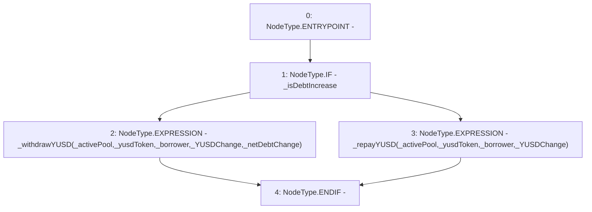

# Context: BorrowerOperations._moveYUSD

**Contract:** `BorrowerOperations` (Inherits: ReentrancyGuard, IBorrowerOperations, CheckContract, Ownable, LiquityBase, YetiCustomBase, BaseMath, ILiquityBase)
**Signature:** `_moveYUSD(IActivePool,IYUSDToken,address,uint256,bool,uint256)`
**Method Selector ID:** `Internal (No Method ID)`
**Visibility:** `internal`
**Environment-Free:** `Yes`
**Modifiers:** None

### State Variables Interaction
- **Reads:** None
- **Writes:** None

### Environment & Verification Flags
- **Uses Foundry Cheatcodes:** No
- **Has Echidna Properties:** No

### Internal Calls Tree
- None

### External Calls / Value Transfers
- None

### Control Flow Graph (CFG)


### Source Mapping
Declared in: `certora-ac-datasets/detasets/web3bugs/dataset/web3bugs/66/packages/contracts/contracts/BorrowerOperations.sol` on lines **1134** to **1147**

```solidity
    function _moveYUSD(
        IActivePool _activePool,
        IYUSDToken _yusdToken,
        address _borrower,
        uint256 _YUSDChange,
        bool _isDebtIncrease,
        uint256 _netDebtChange
    ) internal {
        if (_isDebtIncrease) {
            _withdrawYUSD(_activePool, _yusdToken, _borrower, _YUSDChange, _netDebtChange);
        } else {
            _repayYUSD(_activePool, _yusdToken, _borrower, _YUSDChange);
        }
    }

```
