# Context: BorrowerOperations._openTroveInternal

**Contract:** `BorrowerOperations` (Inherits: ReentrancyGuard, IBorrowerOperations, CheckContract, Ownable, LiquityBase, YetiCustomBase, BaseMath, ILiquityBase)
**Signature:** `_openTroveInternal(address,uint256,uint256,uint256,address,address,address[],uint256[])`
**Method Selector ID:** `Internal (No Method ID)`
**Visibility:** `internal`
**Environment-Free:** `No (reads EVM state context)`
**Modifiers:** None

### State Variables Interaction
- **Reads:** DECIMAL_PRECISION, YUSD_GAS_COMPENSATION, activePool, gasPoolAddress, sortedTroves, troveManager, yusdToken
- **Writes:** None

### Environment & Verification Flags
- **Uses Foundry Cheatcodes:** No
- **Has Echidna Properties:** No

### Internal Calls Tree
- None

### External Calls / Value Transfers
- `ITroveManager.TMP_207(uint256) = HIGH_LEVEL_CALL, dest:REF_225(ITroveManager), function:addTroveOwnerToArray, arguments:['_troveOwner']  `
- `ITroveManager.TMP_203(uint256) = HIGH_LEVEL_CALL, dest:REF_215(ITroveManager), function:increaseTroveDebt, arguments:['_troveOwner', 'REF_217']  `
- `SafeMath.TMP_193(uint256) = LIBRARY_CALL, dest:SafeMath, function:SafeMath.add(uint256,uint256), arguments:['REF_194', 'REF_196'] `
- `SafeMath.TMP_190(uint256) = LIBRARY_CALL, dest:SafeMath, function:SafeMath.sub(uint256,uint256), arguments:['_maxFeePercentage', 'TMP_189'] `
- `SafeMath.TMP_210(uint256) = LIBRARY_CALL, dest:SafeMath, function:SafeMath.sub(uint256,uint256), arguments:['_YUSDAmount', '_totalYUSDDebtFromLever'] `
- `ITroveManager.HIGH_LEVEL_CALL, dest:REF_213(ITroveManager), function:updateTroveColl, arguments:['_troveOwner', '_colls', '_amounts']  `
- `SafeMath.TMP_192(uint256) = LIBRARY_CALL, dest:SafeMath, function:SafeMath.add(uint256,uint256), arguments:['REF_189', 'TMP_191'] `
- `ITroveManager.HIGH_LEVEL_CALL, dest:REF_218(ITroveManager), function:updateTroveRewardSnapshots, arguments:['_troveOwner']  `
- `ITroveManager.HIGH_LEVEL_CALL, dest:REF_211(ITroveManager), function:setTroveStatus, arguments:['_troveOwner', '1']  `
- `ISortedTroves.HIGH_LEVEL_CALL, dest:sortedTroves(ISortedTroves), function:insert, arguments:['_troveOwner', 'REF_223', '_upperHint', '_lowerHint']  `
- `SafeMath.TMP_188(uint256) = LIBRARY_CALL, dest:SafeMath, function:SafeMath.mul(uint256,uint256), arguments:['REF_184', 'DECIMAL_PRECISION'] `
- `SafeMath.TMP_189(uint256) = LIBRARY_CALL, dest:SafeMath, function:SafeMath.div(uint256,uint256), arguments:['TMP_188', 'REF_187'] `
- `IActivePool.HIGH_LEVEL_CALL, dest:REF_228(IActivePool), function:receiveCollateral, arguments:['_colls', '_amounts']  `
- `ITroveManager.HIGH_LEVEL_CALL, dest:REF_220(ITroveManager), function:updateStakeAndTotalStakes, arguments:['_troveOwner']  `
- `LiquityMath.TMP_196(uint256) = LIBRARY_CALL, dest:LiquityMath, function:LiquityMath._computeCR(uint256,uint256), arguments:['REF_202', 'REF_203'] `

### Control Flow Graph (CFG)

```mermaid
flowchart TD
    Node_0["0: NodeType.ENTRYPOINT - "]
    Node_0 --> Node_1
    Node_1["1: NodeType.VARIABLE - "]
    Node_1 --> Node_2
    Node_2["2: NodeType.EXPRESSION - vars.isRecoveryMode = _checkRecoveryMode()"]
    Node_2 --> Node_3
    Node_3["3: NodeType.VARIABLE - contractsCache = ContractsCache(troveManager,activePool,yusdToken)"]
    Node_3 --> Node_4
    Node_4["4: NodeType.EXPRESSION - _requireValidMaxFeePercentage(_maxFeePercentage,vars.isRecoveryMode)"]
    Node_4 --> Node_5
    Node_5["5: NodeType.EXPRESSION - _requireTroveisNotActive(contractsCache.troveManager,_troveOwner)"]
    Node_5 --> Node_6
    Node_6["6: NodeType.EXPRESSION - vars.netDebt = _YUSDAmount"]
    Node_6 --> Node_7
    Node_7["7: NodeType.EXPRESSION - vars.VC = _getVC(_colls,_amounts)"]
    Node_7 --> Node_8
    Node_8["8: NodeType.IF - ! vars.isRecoveryMode"]
    Node_8 --> Node_9
    Node_8 --> Node_11
    Node_9["9: NodeType.EXPRESSION - vars.YUSDFee = _triggerBorrowingFee(contractsCache.troveManager,contractsCache.yusdToken,_YUSDAmount,vars.VC,_maxFeePercentage)"]
    Node_9 --> Node_10
    Node_10["10: NodeType.EXPRESSION - _maxFeePercentage = _maxFeePercentage.sub(vars.YUSDFee.mul(DECIMAL_PRECISION).div(vars.VC))"]
    Node_10 --> Node_11
    Node_11["11: NodeType.ENDIF - "]
    Node_11 --> Node_12
    Node_12["12: NodeType.EXPRESSION - vars.YUSDFee = vars.YUSDFee.add(_getTotalVariableDepositFee(_colls,_amounts,vars.VC,0,vars.VC,_maxFeePercentage,contractsCache))"]
    Node_12 --> Node_13
    Node_13["13: NodeType.EXPRESSION - vars.netDebt = vars.netDebt.add(vars.YUSDFee)"]
    Node_13 --> Node_14
    Node_14["14: NodeType.EXPRESSION - _requireAtLeastMinNetDebt(vars.netDebt)"]
    Node_14 --> Node_15
    Node_15["15: NodeType.EXPRESSION - vars.compositeDebt = _getCompositeDebt(vars.netDebt)"]
    Node_15 --> Node_16
    Node_16["16: NodeType.EXPRESSION - vars.ICR = LiquityMath._computeCR(vars.VC,vars.compositeDebt)"]
    Node_16 --> Node_17
    Node_17["17: NodeType.IF - vars.isRecoveryMode"]
    Node_17 --> Node_18
    Node_17 --> Node_19
    Node_18["18: NodeType.EXPRESSION - _requireICRisAboveCCR(vars.ICR)"]
    Node_18 --> Node_22
    Node_19["19: NodeType.EXPRESSION - _requireICRisAboveMCR(vars.ICR)"]
    Node_19 --> Node_20
    Node_20["20: NodeType.EXPRESSION - vars.newTCR = _getNewTCRFromTroveChange(vars.VC,true,vars.compositeDebt,true)"]
    Node_20 --> Node_21
    Node_21["21: NodeType.EXPRESSION - _requireNewTCRisAboveCCR(vars.newTCR)"]
    Node_21 --> Node_22
    Node_22["22: NodeType.ENDIF - "]
    Node_22 --> Node_23
    Node_23["23: NodeType.EXPRESSION - contractsCache.troveManager.setTroveStatus(_troveOwner,1)"]
    Node_23 --> Node_24
    Node_24["24: NodeType.EXPRESSION - contractsCache.troveManager.updateTroveColl(_troveOwner,_colls,_amounts)"]
    Node_24 --> Node_25
    Node_25["25: NodeType.EXPRESSION - contractsCache.troveManager.increaseTroveDebt(_troveOwner,vars.compositeDebt)"]
    Node_25 --> Node_26
    Node_26["26: NodeType.EXPRESSION - contractsCache.troveManager.updateTroveRewardSnapshots(_troveOwner)"]
    Node_26 --> Node_27
    Node_27["27: NodeType.EXPRESSION - contractsCache.troveManager.updateStakeAndTotalStakes(_troveOwner)"]
    Node_27 --> Node_28
    Node_28["28: NodeType.EXPRESSION - sortedTroves.insert(_troveOwner,vars.ICR,_upperHint,_lowerHint)"]
    Node_28 --> Node_29
    Node_29["29: NodeType.EXPRESSION - vars.arrayIndex = contractsCache.troveManager.addTroveOwnerToArray(_troveOwner)"]
    Node_29 --> Node_30
    Node_30["30: NodeType.EXPRESSION - TroveCreated(_troveOwner,vars.arrayIndex)"]
    Node_30 --> Node_31
    Node_31["31: NodeType.EXPRESSION - contractsCache.activePool.receiveCollateral(_colls,_amounts)"]
    Node_31 --> Node_32
    Node_32["32: NodeType.EXPRESSION - _withdrawYUSD(contractsCache.activePool,contractsCache.yusdToken,_troveOwner,_YUSDAmount.sub(_totalYUSDDebtFromLever),vars.netDebt)"]
    Node_32 --> Node_33
    Node_33["33: NodeType.EXPRESSION - _withdrawYUSD(contractsCache.activePool,contractsCache.yusdToken,gasPoolAddress,YUSD_GAS_COMPENSATION,YUSD_GAS_COMPENSATION)"]
    Node_33 --> Node_34
    Node_34["34: NodeType.EXPRESSION - TroveUpdated(_troveOwner,vars.compositeDebt,_colls,_amounts,BorrowerOperation.openTrove)"]
    Node_34 --> Node_35
    Node_35["35: NodeType.EXPRESSION - YUSDBorrowingFeePaid(_troveOwner,vars.YUSDFee)"]
```


### Source Mapping
Declared in: `certora-ac-datasets/detasets/web3bugs/dataset/web3bugs/66/packages/contracts/contracts/BorrowerOperations.sol` on lines **353** to **452**

```solidity
    function _openTroveInternal(
        address _troveOwner,
        uint256 _maxFeePercentage,
        uint256 _YUSDAmount,
        uint256 _totalYUSDDebtFromLever,
        address _upperHint,
        address _lowerHint,
        address[] memory _colls,
        uint256[] memory _amounts
    ) internal {
        LocalVariables_openTrove memory vars;

        vars.isRecoveryMode = _checkRecoveryMode();

        ContractsCache memory contractsCache = ContractsCache(troveManager, activePool, yusdToken);

        _requireValidMaxFeePercentage(_maxFeePercentage, vars.isRecoveryMode);
        _requireTroveisNotActive(contractsCache.troveManager, _troveOwner);

        vars.netDebt = _YUSDAmount;

        // For every collateral type in, calculate the VC and get the variable fee
        vars.VC = _getVC(_colls, _amounts);

        if (!vars.isRecoveryMode) {
            // when not in recovery mode, add in the 0.5% fee
            vars.YUSDFee = _triggerBorrowingFee(
                contractsCache.troveManager,
                contractsCache.yusdToken,
                _YUSDAmount,
                vars.VC, // here it is just VC in, which is always larger than YUSD amount
                _maxFeePercentage
            );
            _maxFeePercentage = _maxFeePercentage.sub(vars.YUSDFee.mul(DECIMAL_PRECISION).div(vars.VC));
        }

        // Add in variable fee. Always present, even in recovery mode.
        vars.YUSDFee = vars.YUSDFee.add(
            _getTotalVariableDepositFee(_colls, _amounts, vars.VC, 0, vars.VC, _maxFeePercentage, contractsCache)
        );

        // Adds total fees to netDebt
        vars.netDebt = vars.netDebt.add(vars.YUSDFee); // The raw debt change includes the fee

        _requireAtLeastMinNetDebt(vars.netDebt);
        // ICR is based on the composite debt, i.e. the requested YUSD amount + YUSD borrowing fee + YUSD gas comp.
        // _getCompositeDebt returns  vars.netDebt + YUSD gas comp.
        vars.compositeDebt = _getCompositeDebt(vars.netDebt);

        vars.ICR = LiquityMath._computeCR(vars.VC, vars.compositeDebt);
        if (vars.isRecoveryMode) {
            _requireICRisAboveCCR(vars.ICR);
        } else {
            _requireICRisAboveMCR(vars.ICR);
            vars.newTCR = _getNewTCRFromTroveChange(vars.VC, true, vars.compositeDebt, true); // bools: coll increase, debt increase
            _requireNewTCRisAboveCCR(vars.newTCR);
        }

        // Set the trove struct's properties
        contractsCache.troveManager.setTroveStatus(_troveOwner, 1);

        contractsCache.troveManager.updateTroveColl(_troveOwner, _colls, _amounts);
        contractsCache.troveManager.increaseTroveDebt(_troveOwner, vars.compositeDebt);

        contractsCache.troveManager.updateTroveRewardSnapshots(_troveOwner);

        contractsCache.troveManager.updateStakeAndTotalStakes(_troveOwner);

        sortedTroves.insert(_troveOwner, vars.ICR, _upperHint, _lowerHint);
        vars.arrayIndex = contractsCache.troveManager.addTroveOwnerToArray(_troveOwner);
        emit TroveCreated(_troveOwner, vars.arrayIndex);

        contractsCache.activePool.receiveCollateral(_colls, _amounts);

        _withdrawYUSD(
            contractsCache.activePool,
            contractsCache.yusdToken,
            _troveOwner,
            _YUSDAmount.sub(_totalYUSDDebtFromLever),
            vars.netDebt
        );

        // Move the YUSD gas compensation to the Gas Pool
        _withdrawYUSD(
            contractsCache.activePool,
            contractsCache.yusdToken,
            gasPoolAddress,
            YUSD_GAS_COMPENSATION,
            YUSD_GAS_COMPENSATION
        );

        emit TroveUpdated(
            _troveOwner,
            vars.compositeDebt,
            _colls,
            _amounts,
            BorrowerOperation.openTrove
        );
        emit YUSDBorrowingFeePaid(_troveOwner, vars.YUSDFee);
    }

```
