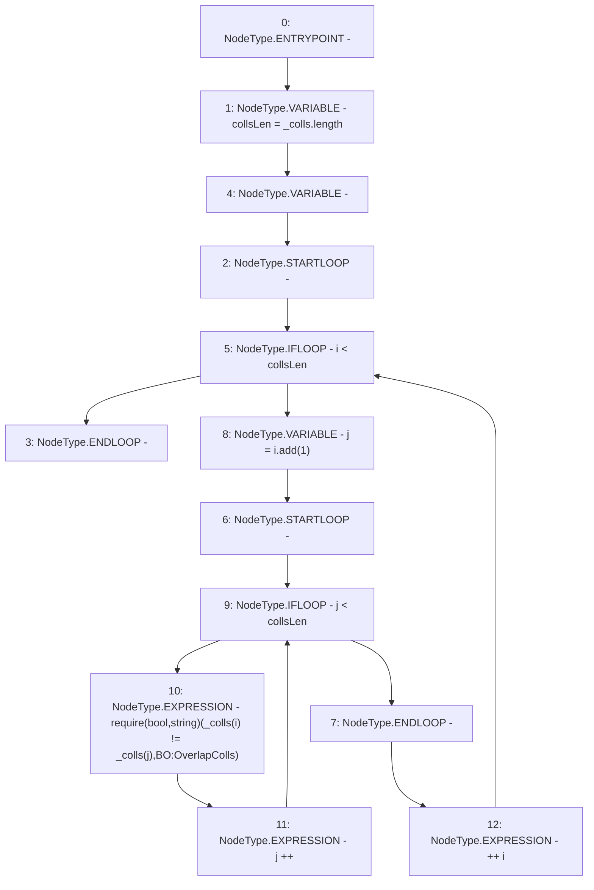

# Context: BorrowerOperations._requireNoDuplicateColls

**Contract:** `BorrowerOperations` (Inherits: ReentrancyGuard, IBorrowerOperations, CheckContract, Ownable, LiquityBase, YetiCustomBase, BaseMath, ILiquityBase)
**Signature:** `_requireNoDuplicateColls(address[])`
**Method Selector ID:** `Internal (No Method ID)`
**Visibility:** `internal`
**Environment-Free:** `Yes`
**Modifiers:** None

### State Variables Interaction
- **Reads:** None
- **Writes:** None

### Assertion Checks & Business Requirements
- require/assert: `require(bool,string)(_colls[i] != _colls[j],BO:OverlapColls)`

### Environment & Verification Flags
- **Uses Foundry Cheatcodes:** No
- **Has Echidna Properties:** No

### Internal Calls Tree
- None

### External Calls / Value Transfers
- `SafeMath.TMP_447(uint256) = LIBRARY_CALL, dest:SafeMath, function:SafeMath.add(uint256,uint256), arguments:['i', '1'] `

### Control Flow Graph (CFG)


### Source Mapping
Declared in: `certora-ac-datasets/detasets/web3bugs/dataset/web3bugs/66/packages/contracts/contracts/BorrowerOperations.sol` on lines **1233** to **1240**

```solidity
    function _requireNoDuplicateColls(address[] memory _colls) internal pure {
        uint256 collsLen = _colls.length;
        for (uint256 i; i < collsLen; ++i) {
            for (uint256 j = i.add(1); j < collsLen; j++) {
                require(_colls[i] != _colls[j], "BO:OverlapColls");
            }
        }
    }

```
