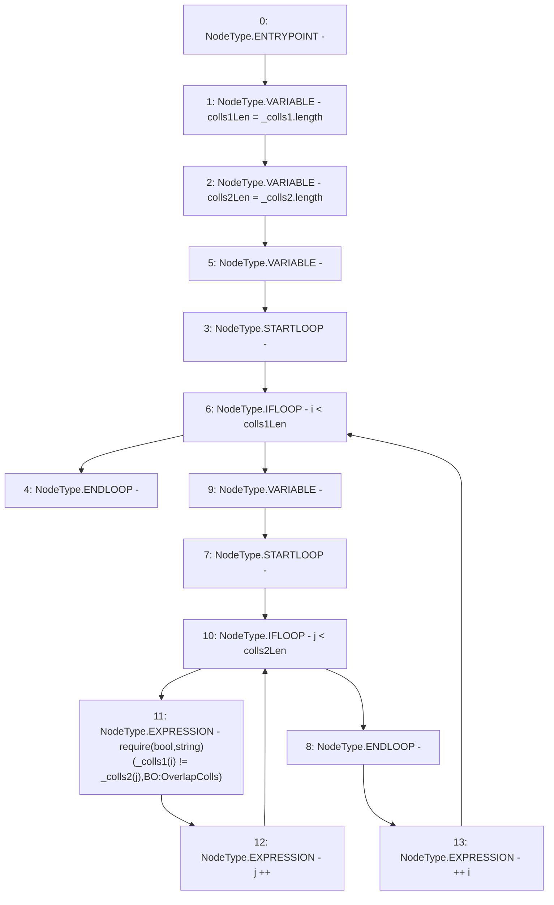

# Context: BorrowerOperations._requireNoOverlapColls

**Contract:** `BorrowerOperations` (Inherits: ReentrancyGuard, IBorrowerOperations, CheckContract, Ownable, LiquityBase, YetiCustomBase, BaseMath, ILiquityBase)
**Signature:** `_requireNoOverlapColls(address[],address[])`
**Method Selector ID:** `Internal (No Method ID)`
**Visibility:** `internal`
**Environment-Free:** `Yes`
**Modifiers:** None

### State Variables Interaction
- **Reads:** None
- **Writes:** None

### Assertion Checks & Business Requirements
- require/assert: `require(bool,string)(_colls1[i] != _colls2[j],BO:OverlapColls)`

### Environment & Verification Flags
- **Uses Foundry Cheatcodes:** No
- **Has Echidna Properties:** No

### Internal Calls Tree
- None

### External Calls / Value Transfers
- None

### Control Flow Graph (CFG)


### Source Mapping
Declared in: `certora-ac-datasets/detasets/web3bugs/dataset/web3bugs/66/packages/contracts/contracts/BorrowerOperations.sol` on lines **1220** to **1231**

```solidity
    function _requireNoOverlapColls(address[] calldata _colls1, address[] calldata _colls2)
        internal
        pure
    {
        uint256 colls1Len = _colls1.length;
        uint256 colls2Len = _colls2.length;
        for (uint256 i; i < colls1Len; ++i) {
            for (uint256 j; j < colls2Len; j++) {
                require(_colls1[i] != _colls2[j], "BO:OverlapColls");
            }
        }
    }

```
