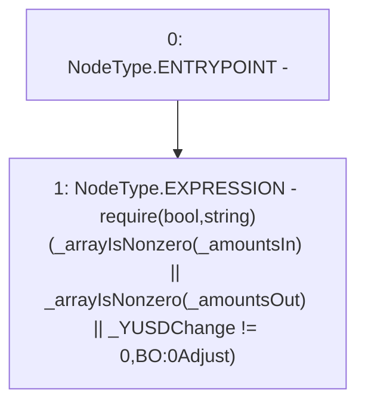

# Context: BorrowerOperations._requireNonZeroAdjustment

**Contract:** `BorrowerOperations` (Inherits: ReentrancyGuard, IBorrowerOperations, CheckContract, Ownable, LiquityBase, YetiCustomBase, BaseMath, ILiquityBase)
**Signature:** `_requireNonZeroAdjustment(uint256[],uint256[],uint256)`
**Method Selector ID:** `Internal (No Method ID)`
**Visibility:** `internal`
**Environment-Free:** `Yes`
**Modifiers:** None

### State Variables Interaction
- **Reads:** None
- **Writes:** None

### Assertion Checks & Business Requirements
- require/assert: `require(bool,string)(_arrayIsNonzero(_amountsIn) || _arrayIsNonzero(_amountsOut) || _YUSDChange != 0,BO:0Adjust)`

### Environment & Verification Flags
- **Uses Foundry Cheatcodes:** No
- **Has Echidna Properties:** No

### Internal Calls Tree
- None

### External Calls / Value Transfers
- None

### Control Flow Graph (CFG)


### Source Mapping
Declared in: `certora-ac-datasets/detasets/web3bugs/dataset/web3bugs/66/packages/contracts/contracts/BorrowerOperations.sol` on lines **1183** to **1192**

```solidity
    function _requireNonZeroAdjustment(
        uint256[] memory _amountsIn,
        uint256[] memory _amountsOut,
        uint256 _YUSDChange
    ) internal pure {
        require(
            _arrayIsNonzero(_amountsIn) || _arrayIsNonzero(_amountsOut) || _YUSDChange != 0,
            "BO:0Adjust"
        );
    }

```
