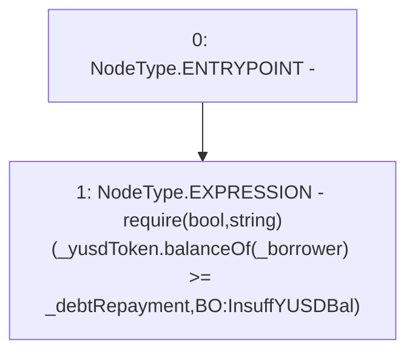

# Context: BorrowerOperations._requireSufficientYUSDBalance

**Contract:** `BorrowerOperations` (Inherits: ReentrancyGuard, IBorrowerOperations, CheckContract, Ownable, LiquityBase, YetiCustomBase, BaseMath, ILiquityBase)
**Signature:** `_requireSufficientYUSDBalance(IYUSDToken,address,uint256)`
**Method Selector ID:** `Internal (No Method ID)`
**Visibility:** `internal`
**Environment-Free:** `Yes`
**Modifiers:** None

### State Variables Interaction
- **Reads:** None
- **Writes:** None

### Assertion Checks & Business Requirements
- require/assert: `require(bool,string)(_yusdToken.balanceOf(_borrower) >= _debtRepayment,BO:InsuffYUSDBal)`

### Environment & Verification Flags
- **Uses Foundry Cheatcodes:** No
- **Has Echidna Properties:** No

### Internal Calls Tree
- None

### External Calls / Value Transfers
- `IYUSDToken.TMP_481(uint256) = HIGH_LEVEL_CALL, dest:_yusdToken(IYUSDToken), function:balanceOf, arguments:['_borrower']  `

### Control Flow Graph (CFG)


### Source Mapping
Declared in: `certora-ac-datasets/detasets/web3bugs/dataset/web3bugs/66/packages/contracts/contracts/BorrowerOperations.sol` on lines **1340** to **1349**

```solidity
    function _requireSufficientYUSDBalance(
        IYUSDToken _yusdToken,
        address _borrower,
        uint256 _debtRepayment
    ) internal view {
        require(
            _yusdToken.balanceOf(_borrower) >= _debtRepayment,
            "BO:InsuffYUSDBal"
        );
    }

```
