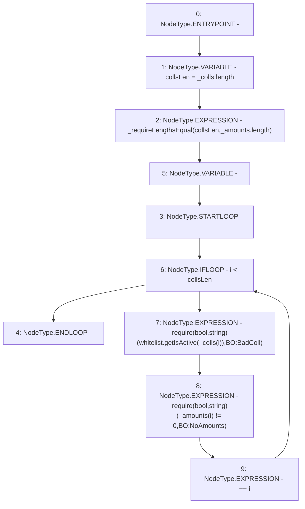

# Context: BorrowerOperations._requireValidDepositCollateral

**Contract:** `BorrowerOperations` (Inherits: ReentrancyGuard, IBorrowerOperations, CheckContract, Ownable, LiquityBase, YetiCustomBase, BaseMath, ILiquityBase)
**Signature:** `_requireValidDepositCollateral(address[],uint256[])`
**Method Selector ID:** `Internal (No Method ID)`
**Visibility:** `internal`
**Environment-Free:** `Yes`
**Modifiers:** None

### State Variables Interaction
- **Reads:** whitelist
- **Writes:** None

### Assertion Checks & Business Requirements
- require/assert: `require(bool,string)(whitelist.getIsActive(_colls[i]),BO:BadColl)`
- require/assert: `require(bool,string)(_amounts[i] != 0,BO:NoAmounts)`

### Environment & Verification Flags
- **Uses Foundry Cheatcodes:** No
- **Has Echidna Properties:** No

### Internal Calls Tree
- None

### External Calls / Value Transfers
- `IWhitelist.TMP_420(bool) = HIGH_LEVEL_CALL, dest:whitelist(IWhitelist), function:getIsActive, arguments:['REF_570']  `

### Control Flow Graph (CFG)


### Source Mapping
Declared in: `certora-ac-datasets/detasets/web3bugs/dataset/web3bugs/66/packages/contracts/contracts/BorrowerOperations.sol` on lines **1174** to **1181**

```solidity
    function _requireValidDepositCollateral(address[] memory _colls, uint256[] memory _amounts) internal view {
        uint256 collsLen = _colls.length;
        _requireLengthsEqual(collsLen, _amounts.length);
        for (uint256 i; i < collsLen; ++i) {
            require(whitelist.getIsActive(_colls[i]), "BO:BadColl");
            require(_amounts[i] != 0, "BO:NoAmounts");
        }
    }

```
