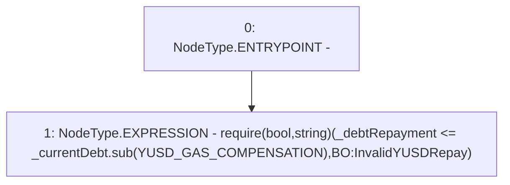

# Context: BorrowerOperations._requireValidYUSDRepayment

**Contract:** `BorrowerOperations` (Inherits: ReentrancyGuard, IBorrowerOperations, CheckContract, Ownable, LiquityBase, YetiCustomBase, BaseMath, ILiquityBase)
**Signature:** `_requireValidYUSDRepayment(uint256,uint256)`
**Method Selector ID:** `Internal (No Method ID)`
**Visibility:** `internal`
**Environment-Free:** `Yes`
**Modifiers:** None

### State Variables Interaction
- **Reads:** YUSD_GAS_COMPENSATION
- **Writes:** None

### Assertion Checks & Business Requirements
- require/assert: `require(bool,string)(_debtRepayment <= _currentDebt.sub(YUSD_GAS_COMPENSATION),BO:InvalidYUSDRepay)`

### Environment & Verification Flags
- **Uses Foundry Cheatcodes:** No
- **Has Echidna Properties:** No

### Internal Calls Tree
- None

### External Calls / Value Transfers
- `SafeMath.TMP_478(uint256) = LIBRARY_CALL, dest:SafeMath, function:SafeMath.sub(uint256,uint256), arguments:['_currentDebt', 'YUSD_GAS_COMPENSATION'] `

### Control Flow Graph (CFG)


### Source Mapping
Declared in: `certora-ac-datasets/detasets/web3bugs/dataset/web3bugs/66/packages/contracts/contracts/BorrowerOperations.sol` on lines **1333** to **1338**

```solidity
    function _requireValidYUSDRepayment(uint256 _currentDebt, uint256 _debtRepayment) internal pure {
        require(
            _debtRepayment <= _currentDebt.sub(YUSD_GAS_COMPENSATION),
            "BO:InvalidYUSDRepay"
        );
    }

```
