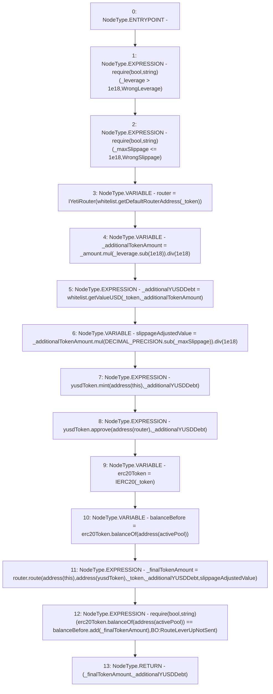

# Context: BorrowerOperations._singleLeverUp

**Contract:** `BorrowerOperations` (Inherits: ReentrancyGuard, IBorrowerOperations, CheckContract, Ownable, LiquityBase, YetiCustomBase, BaseMath, ILiquityBase)
**Signature:** `_singleLeverUp(address,uint256,uint256,uint256) returns (uint256, uint256)`
**Method Selector ID:** `Internal (No Method ID)`
**Visibility:** `internal`
**Environment-Free:** `Yes`
**Modifiers:** None

### State Variables Interaction
- **Reads:** DECIMAL_PRECISION, activePool, whitelist, yusdToken
- **Writes:** None

### Assertion Checks & Business Requirements
- require/assert: `require(bool,string)(_leverage > 1e18,WrongLeverage)`
- require/assert: `require(bool,string)(_maxSlippage <= 1e18,WrongSlippage)`
- require/assert: `require(bool,string)(erc20Token.balanceOf(address(activePool)) == balanceBefore.add(_finalTokenAmount),BO:RouteLeverUpNotSent)`

### Environment & Verification Flags
- **Uses Foundry Cheatcodes:** No
- **Has Echidna Properties:** No

### Internal Calls Tree
- None

### External Calls / Value Transfers
- `SafeMath.TMP_161(uint256) = LIBRARY_CALL, dest:SafeMath, function:SafeMath.div(uint256,uint256), arguments:['TMP_160', '1000000000000000000'] `
- `IYetiRouter.TMP_175(uint256) = HIGH_LEVEL_CALL, dest:router(IYetiRouter), function:route, arguments:['TMP_173', 'TMP_174', '_token', '_additionalYUSDDebt', 'slippageAdjustedValue']  `
- `IERC20.TMP_177(uint256) = HIGH_LEVEL_CALL, dest:erc20Token(IERC20), function:balanceOf, arguments:['TMP_176']  `
- `SafeMath.TMP_165(uint256) = LIBRARY_CALL, dest:SafeMath, function:SafeMath.div(uint256,uint256), arguments:['TMP_164', '1000000000000000000'] `
- `IERC20.TMP_172(uint256) = HIGH_LEVEL_CALL, dest:erc20Token(IERC20), function:balanceOf, arguments:['TMP_171']  `
- `IWhitelist.TMP_162(uint256) = HIGH_LEVEL_CALL, dest:whitelist(IWhitelist), function:getValueUSD, arguments:['_token', '_additionalTokenAmount']  `
- `SafeMath.TMP_163(uint256) = LIBRARY_CALL, dest:SafeMath, function:SafeMath.sub(uint256,uint256), arguments:['DECIMAL_PRECISION', '_maxSlippage'] `
- `IWhitelist.TMP_157(address) = HIGH_LEVEL_CALL, dest:whitelist(IWhitelist), function:getDefaultRouterAddress, arguments:['_token']  `
- `IYUSDToken.TMP_169(bool) = HIGH_LEVEL_CALL, dest:yusdToken(IYUSDToken), function:approve, arguments:['TMP_168', '_additionalYUSDDebt']  `
- `SafeMath.TMP_178(uint256) = LIBRARY_CALL, dest:SafeMath, function:SafeMath.add(uint256,uint256), arguments:['balanceBefore', '_finalTokenAmount'] `
- `SafeMath.TMP_160(uint256) = LIBRARY_CALL, dest:SafeMath, function:SafeMath.mul(uint256,uint256), arguments:['_amount', 'TMP_159'] `
- `SafeMath.TMP_164(uint256) = LIBRARY_CALL, dest:SafeMath, function:SafeMath.mul(uint256,uint256), arguments:['_additionalTokenAmount', 'TMP_163'] `
- `SafeMath.TMP_159(uint256) = LIBRARY_CALL, dest:SafeMath, function:SafeMath.sub(uint256,uint256), arguments:['_leverage', '1000000000000000000'] `
- `IYUSDToken.HIGH_LEVEL_CALL, dest:yusdToken(IYUSDToken), function:mint, arguments:['TMP_166', '_additionalYUSDDebt']  `

### Control Flow Graph (CFG)


### Source Mapping
Declared in: `certora-ac-datasets/detasets/web3bugs/dataset/web3bugs/66/packages/contracts/contracts/BorrowerOperations.sol` on lines **315** to **346**

```solidity
    function _singleLeverUp(address _token, 
        uint256 _amount, 
        uint256 _leverage, 
        uint256 _maxSlippage) 
        internal
        returns (uint256 _finalTokenAmount, uint256 _additionalYUSDDebt) {
        require(_leverage > 1e18, "WrongLeverage");
        require(_maxSlippage <= 1e18, "WrongSlippage");
        IYetiRouter router = IYetiRouter(whitelist.getDefaultRouterAddress(_token));
        // leverage is 5e18 for 5x leverage. Minus 1 for what the user already has in collateral value.
        uint _additionalTokenAmount = _amount.mul(_leverage.sub(1e18)).div(1e18); 
        _additionalYUSDDebt = whitelist.getValueUSD(_token, _additionalTokenAmount);

        // 1/(1-1/ICR) = leverage. (1 - 1/ICR) = 1/leverage
        // 1 - 1/leverage = 1/ICR. ICR = 1/(1 - 1/leverage) = (1/((leverage-1)/leverage)) = leverage / (leverage - 1)
        // ICR = leverage / (leverage - 1)
        
        // ICR = VC value of collateral / debt 
        // debt = VC value of collateral / ICR.
        // debt = VC value of collateral * (leverage - 1) / leverage

        uint256 slippageAdjustedValue = _additionalTokenAmount.mul(DECIMAL_PRECISION.sub(_maxSlippage)).div(1e18);
        
        yusdToken.mint(address(this), _additionalYUSDDebt);
        yusdToken.approve(address(router), _additionalYUSDDebt);
        // route will swap the tokens and transfer it to the active pool automatically. Router will send to active pool and 
        // reward balance will be sent to the user if wrapped asset. 
        IERC20 erc20Token = IERC20(_token);
        uint256 balanceBefore = erc20Token.balanceOf(address(activePool));
        _finalTokenAmount = router.route(address(this), address(yusdToken), _token, _additionalYUSDDebt, slippageAdjustedValue);
        require(erc20Token.balanceOf(address(activePool)) == balanceBefore.add(_finalTokenAmount), "BO:RouteLeverUpNotSent");
    }

```
