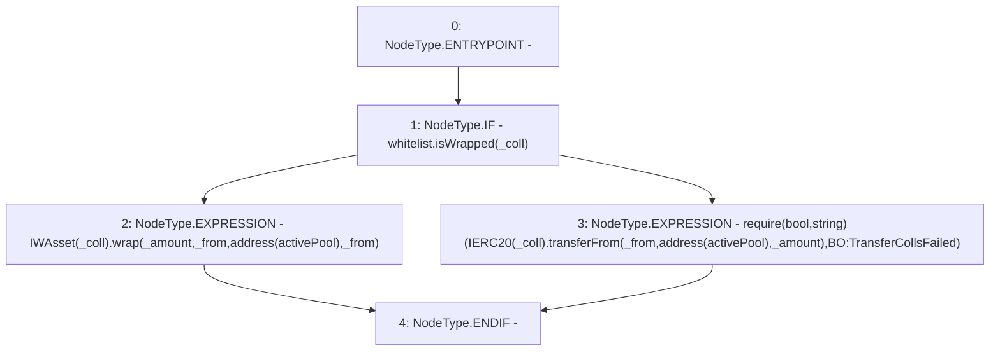

# Context: BorrowerOperations._singleTransferCollateralIntoActivePool

**Contract:** `BorrowerOperations` (Inherits: ReentrancyGuard, IBorrowerOperations, CheckContract, Ownable, LiquityBase, YetiCustomBase, BaseMath, ILiquityBase)
**Signature:** `_singleTransferCollateralIntoActivePool(address,address,uint256)`
**Method Selector ID:** `Internal (No Method ID)`
**Visibility:** `internal`
**Environment-Free:** `Yes`
**Modifiers:** None

### State Variables Interaction
- **Reads:** activePool, whitelist
- **Writes:** None

### Assertion Checks & Business Requirements
- require/assert: `require(bool,string)(IERC20(_coll).transferFrom(_from,address(activePool),_amount),BO:TransferCollsFailed)`

### Environment & Verification Flags
- **Uses Foundry Cheatcodes:** No
- **Has Echidna Properties:** No

### Internal Calls Tree
- None

### External Calls / Value Transfers
- `IERC20.TMP_393(bool) = HIGH_LEVEL_CALL, dest:TMP_391(IERC20), function:transferFrom, arguments:['_from', 'TMP_392', '_amount']  `
- `IWhitelist.TMP_387(bool) = HIGH_LEVEL_CALL, dest:whitelist(IWhitelist), function:isWrapped, arguments:['_coll']  `
- `IWAsset.HIGH_LEVEL_CALL, dest:TMP_388(IWAsset), function:wrap, arguments:['_amount', '_from', 'TMP_389', '_from']  `

### Control Flow Graph (CFG)


### Source Mapping
Declared in: `certora-ac-datasets/detasets/web3bugs/dataset/web3bugs/66/packages/contracts/contracts/BorrowerOperations.sol` on lines **1042** to **1054**

```solidity
    function _singleTransferCollateralIntoActivePool(
        address _from,
        address _coll,
        uint256 _amount
    ) internal {
        if (whitelist.isWrapped(_coll)) {
            // If wrapped asset then it wraps it and sends the wrapped version to the active pool, 
            // and updates reward balance to the new owner. 
            IWAsset(_coll).wrap(_amount, _from, address(activePool), _from); 
        } else {
            require(IERC20(_coll).transferFrom(_from, address(activePool), _amount), "BO:TransferCollsFailed");
        }
    }

```
