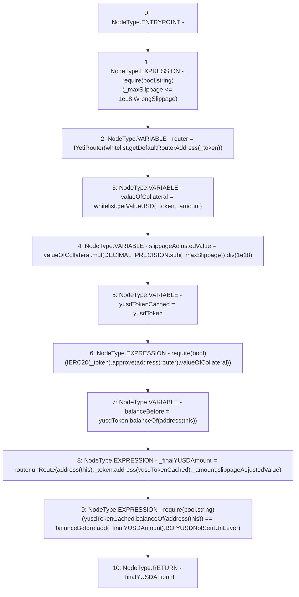

# Context: BorrowerOperations._singleUnleverUp

**Contract:** `BorrowerOperations` (Inherits: ReentrancyGuard, IBorrowerOperations, CheckContract, Ownable, LiquityBase, YetiCustomBase, BaseMath, ILiquityBase)
**Signature:** `_singleUnleverUp(address,uint256,uint256) returns (uint256)`
**Method Selector ID:** `Internal (No Method ID)`
**Visibility:** `internal`
**Environment-Free:** `Yes`
**Modifiers:** None

### State Variables Interaction
- **Reads:** DECIMAL_PRECISION, whitelist, yusdToken
- **Writes:** None

### Assertion Checks & Business Requirements
- require/assert: `require(bool,string)(_maxSlippage <= 1e18,WrongSlippage)`
- require/assert: `require(bool)(IERC20(_token).approve(address(router),valueOfCollateral))`
- require/assert: `require(bool,string)(yusdTokenCached.balanceOf(address(this)) == balanceBefore.add(_finalYUSDAmount),BO:YUSDNotSentUnLever)`

### Environment & Verification Flags
- **Uses Foundry Cheatcodes:** No
- **Has Echidna Properties:** No

### Internal Calls Tree
- None

### External Calls / Value Transfers
- `SafeMath.TMP_327(uint256) = LIBRARY_CALL, dest:SafeMath, function:SafeMath.add(uint256,uint256), arguments:['balanceBefore', '_finalYUSDAmount'] `
- `IYUSDToken.TMP_321(uint256) = HIGH_LEVEL_CALL, dest:yusdToken(IYUSDToken), function:balanceOf, arguments:['TMP_320']  `
- `SafeMath.TMP_313(uint256) = LIBRARY_CALL, dest:SafeMath, function:SafeMath.sub(uint256,uint256), arguments:['DECIMAL_PRECISION', '_maxSlippage'] `
- `IWhitelist.TMP_312(uint256) = HIGH_LEVEL_CALL, dest:whitelist(IWhitelist), function:getValueUSD, arguments:['_token', '_amount']  `
- `SafeMath.TMP_314(uint256) = LIBRARY_CALL, dest:SafeMath, function:SafeMath.mul(uint256,uint256), arguments:['valueOfCollateral', 'TMP_313'] `
- `IWhitelist.TMP_310(address) = HIGH_LEVEL_CALL, dest:whitelist(IWhitelist), function:getDefaultRouterAddress, arguments:['_token']  `
- `IERC20.TMP_318(bool) = HIGH_LEVEL_CALL, dest:TMP_316(IERC20), function:approve, arguments:['TMP_317', 'valueOfCollateral']  `
- `IERC20.TMP_326(uint256) = HIGH_LEVEL_CALL, dest:yusdTokenCached(IERC20), function:balanceOf, arguments:['TMP_325']  `
- `IYetiRouter.TMP_324(uint256) = HIGH_LEVEL_CALL, dest:router(IYetiRouter), function:unRoute, arguments:['TMP_322', '_token', 'TMP_323', '_amount', 'slippageAdjustedValue']  `
- `SafeMath.TMP_315(uint256) = LIBRARY_CALL, dest:SafeMath, function:SafeMath.div(uint256,uint256), arguments:['TMP_314', '1000000000000000000'] `

### Control Flow Graph (CFG)


### Source Mapping
Declared in: `certora-ac-datasets/detasets/web3bugs/dataset/web3bugs/66/packages/contracts/contracts/BorrowerOperations.sol` on lines **808** to **827**

```solidity
    function _singleUnleverUp(address _token, 
        uint256 _amount, 
        uint256 _maxSlippage) 
        internal
        returns (uint256 _finalYUSDAmount) {
        require(_maxSlippage <= 1e18, "WrongSlippage");
        // if wrapped token, then does i t automatically transfer to active pool?
        // It should actually transfer to the owner, who will have bOps pre approved
        // cause of original approve
        IYetiRouter router = IYetiRouter(whitelist.getDefaultRouterAddress(_token));
        // then calculate value amount of expected YUSD output based on amount of token to sell

        uint valueOfCollateral = whitelist.getValueUSD(_token, _amount);
        uint256 slippageAdjustedValue = valueOfCollateral.mul(DECIMAL_PRECISION.sub(_maxSlippage)).div(1e18);
        IERC20 yusdTokenCached = yusdToken;
        require(IERC20(_token).approve(address(router), valueOfCollateral));
        uint256 balanceBefore = yusdToken.balanceOf(address(this));
        _finalYUSDAmount = router.unRoute(address(this), _token, address(yusdTokenCached), _amount, slippageAdjustedValue);
        require(yusdTokenCached.balanceOf(address(this)) == balanceBefore.add(_finalYUSDAmount), "BO:YUSDNotSentUnLever");
    }

```
