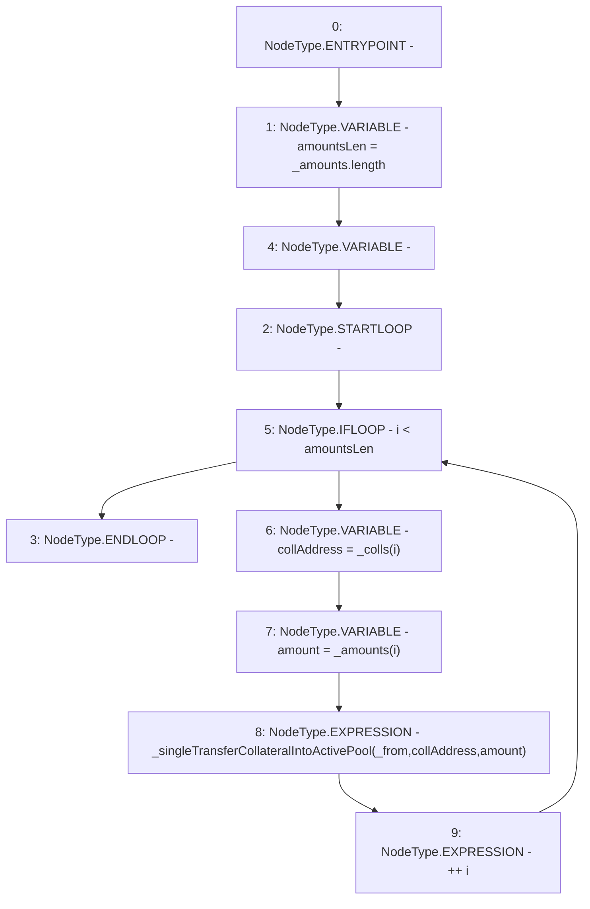

# Context: BorrowerOperations._transferCollateralsIntoActivePool

**Contract:** `BorrowerOperations` (Inherits: ReentrancyGuard, IBorrowerOperations, CheckContract, Ownable, LiquityBase, YetiCustomBase, BaseMath, ILiquityBase)
**Signature:** `_transferCollateralsIntoActivePool(address,address[],uint256[])`
**Method Selector ID:** `Internal (No Method ID)`
**Visibility:** `internal`
**Environment-Free:** `Yes`
**Modifiers:** None

### State Variables Interaction
- **Reads:** None
- **Writes:** None

### Environment & Verification Flags
- **Uses Foundry Cheatcodes:** No
- **Has Echidna Properties:** No

### Internal Calls Tree
- None

### External Calls / Value Transfers
- None

### Control Flow Graph (CFG)


### Source Mapping
Declared in: `certora-ac-datasets/detasets/web3bugs/dataset/web3bugs/66/packages/contracts/contracts/BorrowerOperations.sol` on lines **1024** to **1039**

```solidity
    function _transferCollateralsIntoActivePool(
        address _from,
        address[] memory _colls,
        uint256[] memory _amounts
    ) internal {
        uint256 amountsLen = _amounts.length;
        for (uint256 i; i < amountsLen; ++i) {
            address collAddress = _colls[i];
            uint256 amount = _amounts[i];
            _singleTransferCollateralIntoActivePool(
                _from,
                collAddress,
                amount
            );
        }
    }

```
