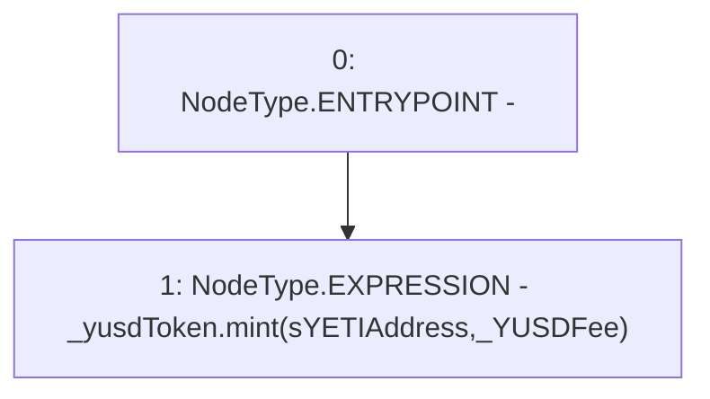

# Context: BorrowerOperations._triggerDepositFee

**Contract:** `BorrowerOperations` (Inherits: ReentrancyGuard, IBorrowerOperations, CheckContract, Ownable, LiquityBase, YetiCustomBase, BaseMath, ILiquityBase)
**Signature:** `_triggerDepositFee(IYUSDToken,uint256)`
**Method Selector ID:** `Internal (No Method ID)`
**Visibility:** `internal`
**Environment-Free:** `Yes`
**Modifiers:** None

### State Variables Interaction
- **Reads:** sYETIAddress
- **Writes:** None

### Environment & Verification Flags
- **Uses Foundry Cheatcodes:** No
- **Has Echidna Properties:** No

### Internal Calls Tree
- None

### External Calls / Value Transfers
- `IYUSDToken.HIGH_LEVEL_CALL, dest:_yusdToken(IYUSDToken), function:mint, arguments:['sYETIAddress', '_YUSDFee']  `

### Control Flow Graph (CFG)


### Source Mapping
Declared in: `certora-ac-datasets/detasets/web3bugs/dataset/web3bugs/66/packages/contracts/contracts/BorrowerOperations.sol` on lines **1076** to **1079**

```solidity
    function _triggerDepositFee(IYUSDToken _yusdToken, uint256 _YUSDFee) internal {
        // Send fee to sYETI contract
        _yusdToken.mint(sYETIAddress, _YUSDFee);
    }

```
