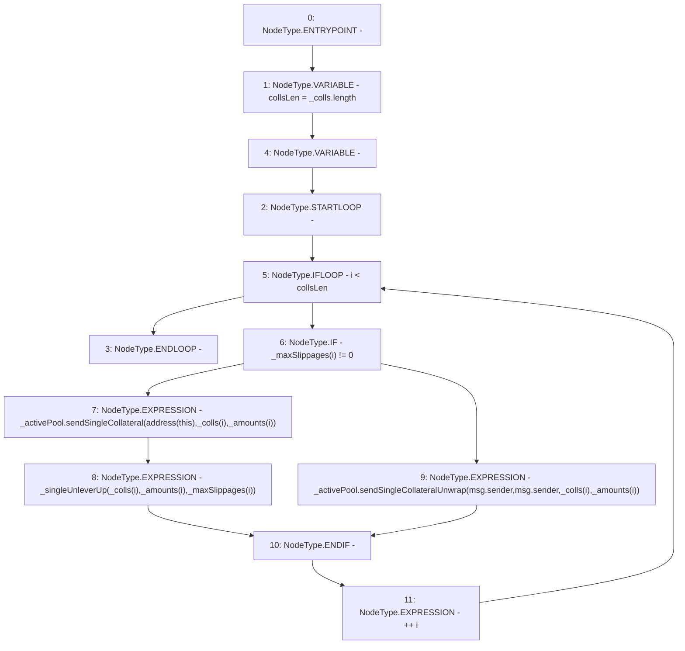

# Context: BorrowerOperations._unleverColls

**Contract:** `BorrowerOperations` (Inherits: ReentrancyGuard, IBorrowerOperations, CheckContract, Ownable, LiquityBase, YetiCustomBase, BaseMath, ILiquityBase)
**Signature:** `_unleverColls(IActivePool,address[],uint256[],uint256[])`
**Method Selector ID:** `Internal (No Method ID)`
**Visibility:** `internal`
**Environment-Free:** `No (reads EVM state context)`
**Modifiers:** None

### State Variables Interaction
- **Reads:** None
- **Writes:** None

### Environment & Verification Flags
- **Uses Foundry Cheatcodes:** No
- **Has Echidna Properties:** No

### Internal Calls Tree
- None

### External Calls / Value Transfers
- `IActivePool.TMP_335(bool) = HIGH_LEVEL_CALL, dest:_activePool(IActivePool), function:sendSingleCollateralUnwrap, arguments:['msg.sender', 'msg.sender', 'REF_472', 'REF_473']  `
- `IActivePool.TMP_333(bool) = HIGH_LEVEL_CALL, dest:_activePool(IActivePool), function:sendSingleCollateral, arguments:['TMP_332', 'REF_466', 'REF_467']  `

### Control Flow Graph (CFG)


### Source Mapping
Declared in: `certora-ac-datasets/detasets/web3bugs/dataset/web3bugs/66/packages/contracts/contracts/BorrowerOperations.sol` on lines **831** to **846**

```solidity
    function _unleverColls(
        IActivePool _activePool, 
        address[] memory _colls, 
        uint256[] memory _amounts, 
        uint256[] memory _maxSlippages
    ) internal {
        uint256 collsLen = _colls.length;
        for (uint256 i; i < collsLen; ++i) {
            if (_maxSlippages[i] != 0) {
                _activePool.sendSingleCollateral(address(this), _colls[i], _amounts[i]);
                _singleUnleverUp(_colls[i], _amounts[i], _maxSlippages[i]);
            } else {
                _activePool.sendSingleCollateralUnwrap(msg.sender, msg.sender, _colls[i], _amounts[i]);
            }
        }
    }

```
