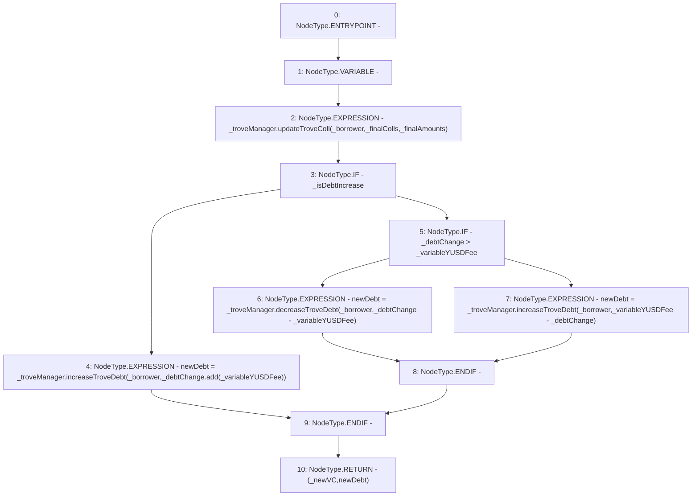

# Context: BorrowerOperations._updateTroveFromAdjustment

**Contract:** `BorrowerOperations` (Inherits: ReentrancyGuard, IBorrowerOperations, CheckContract, Ownable, LiquityBase, YetiCustomBase, BaseMath, ILiquityBase)
**Signature:** `_updateTroveFromAdjustment(ITroveManager,address,address[],uint256[],uint256,uint256,bool,uint256) returns (uint256, uint256)`
**Method Selector ID:** `Internal (No Method ID)`
**Visibility:** `internal`
**Environment-Free:** `Yes`
**Modifiers:** None

### State Variables Interaction
- **Reads:** None
- **Writes:** None

### Environment & Verification Flags
- **Uses Foundry Cheatcodes:** No
- **Has Echidna Properties:** No

### Internal Calls Tree
- None

### External Calls / Value Transfers
- `ITroveManager.TMP_402(uint256) = HIGH_LEVEL_CALL, dest:_troveManager(ITroveManager), function:increaseTroveDebt, arguments:['_borrower', 'TMP_401']  `
- `ITroveManager.TMP_407(uint256) = HIGH_LEVEL_CALL, dest:_troveManager(ITroveManager), function:increaseTroveDebt, arguments:['_borrower', 'TMP_406']  `
- `SafeMath.TMP_401(uint256) = LIBRARY_CALL, dest:SafeMath, function:SafeMath.add(uint256,uint256), arguments:['_debtChange', '_variableYUSDFee'] `
- `ITroveManager.HIGH_LEVEL_CALL, dest:_troveManager(ITroveManager), function:updateTroveColl, arguments:['_borrower', '_finalColls', '_finalAmounts']  `
- `ITroveManager.TMP_405(uint256) = HIGH_LEVEL_CALL, dest:_troveManager(ITroveManager), function:decreaseTroveDebt, arguments:['_borrower', 'TMP_404']  `

### Control Flow Graph (CFG)


### Source Mapping
Declared in: `certora-ac-datasets/detasets/web3bugs/dataset/web3bugs/66/packages/contracts/contracts/BorrowerOperations.sol` on lines **1082** to **1105**

```solidity
    function _updateTroveFromAdjustment(
        ITroveManager _troveManager,
        address _borrower,
        address[] memory _finalColls,
        uint256[] memory _finalAmounts,
        uint256 _newVC,
        uint256 _debtChange,
        bool _isDebtIncrease, 
        uint256 _variableYUSDFee
    ) internal returns (uint256, uint256) {
        uint256 newDebt;
        _troveManager.updateTroveColl(_borrower, _finalColls, _finalAmounts);
        if (_isDebtIncrease) { // if debt increase, increase by both amounts
           newDebt = _troveManager.increaseTroveDebt(_borrower, _debtChange.add(_variableYUSDFee));
        } else {
            if (_debtChange > _variableYUSDFee) { // if debt decrease, and greater than variable fee, decrease 
                newDebt = _troveManager.decreaseTroveDebt(_borrower, _debtChange - _variableYUSDFee); // already checked no safemath needed
            } else { // otherwise increase by opposite subtraction
                newDebt = _troveManager.increaseTroveDebt(_borrower, _variableYUSDFee - _debtChange); // already checked no safemath needed
            }
        }

        return (_newVC, newDebt);
    }

```
