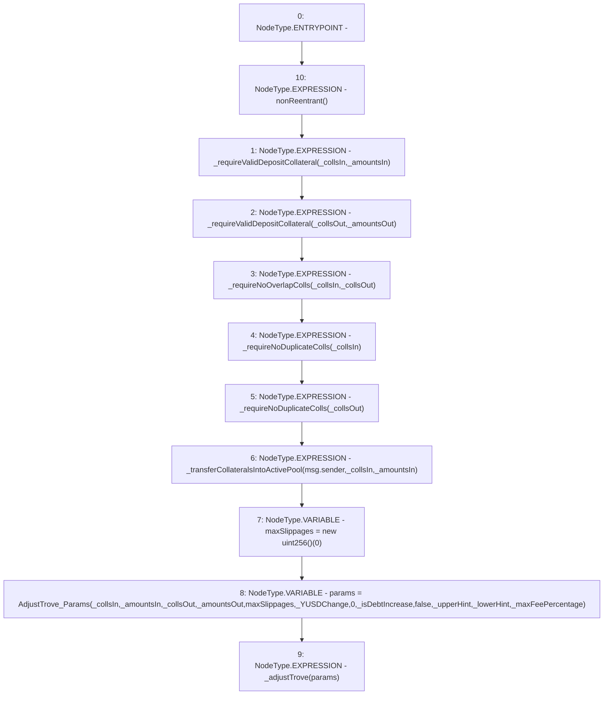

# Context: BorrowerOperations.adjustTrove

**Contract:** `BorrowerOperations` (Inherits: ReentrancyGuard, IBorrowerOperations, CheckContract, Ownable, LiquityBase, YetiCustomBase, BaseMath, ILiquityBase)
**Signature:** `adjustTrove(address[],uint256[],address[],uint256[],uint256,bool,address,address,uint256)`
**Method Selector ID:** `0xc49f843a`
**Visibility:** `external`
**Environment-Free:** `No (reads EVM state context)`
**Modifiers:**
- `nonReentrant`
  ```solidity
  modifier nonReentrant() {
          // On the first call to nonReentrant, _notEntered will be true
          require(_status != _ENTERED, "ReentrancyGuard: reentrant call");
  
          // Any calls to nonReentrant after this point will fail
          _status = _ENTERED;
  
          _;
  
          // By storing the original value once again, a refund is triggered (see
          // https://eips.ethereum.org/EIPS/eip-2200)
          _status = _NOT_ENTERED;
      }
  ```

### State Variables Interaction
- **Reads:** None
- **Writes:** None

### Environment & Verification Flags
- **Uses Foundry Cheatcodes:** No
- **Has Echidna Properties:** No

### Internal Calls Tree
- None

### External Calls / Value Transfers
- None

### Control Flow Graph (CFG)


### Source Mapping
Declared in: `certora-ac-datasets/detasets/web3bugs/dataset/web3bugs/66/packages/contracts/contracts/BorrowerOperations.sol` on lines **589** to **627**

```solidity
    function adjustTrove(
        address[] calldata _collsIn,
        uint256[] memory _amountsIn,
        address[] calldata _collsOut,
        uint256[] calldata _amountsOut,
        uint256 _YUSDChange,
        bool _isDebtIncrease,
        address _upperHint,
        address _lowerHint,
        uint256 _maxFeePercentage
    ) external override nonReentrant {
        // check that all _collsIn collateral types are in the whitelist
        _requireValidDepositCollateral(_collsIn, _amountsIn);
        _requireValidDepositCollateral(_collsOut, _amountsOut);
        _requireNoOverlapColls(_collsIn, _collsOut); // check that there are no overlap between _collsIn and _collsOut
        _requireNoDuplicateColls(_collsIn);
        _requireNoDuplicateColls(_collsOut);

        // pull in deposit collateral
        _transferCollateralsIntoActivePool(msg.sender, _collsIn, _amountsIn);
        uint256[] memory maxSlippages = new uint256[](0);

        AdjustTrove_Params memory params = AdjustTrove_Params(
            _collsIn,
            _amountsIn,
            _collsOut,
            _amountsOut,
            maxSlippages,
            _YUSDChange,
            0,
            _isDebtIncrease,
            false,
            _upperHint,
            _lowerHint,
            _maxFeePercentage
        );

        _adjustTrove(params);
    }

```
