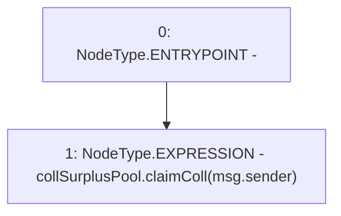

# Context: BorrowerOperations.claimCollateral

**Contract:** `BorrowerOperations` (Inherits: ReentrancyGuard, IBorrowerOperations, CheckContract, Ownable, LiquityBase, YetiCustomBase, BaseMath, ILiquityBase)
**Signature:** `claimCollateral()`
**Method Selector ID:** `0x6f0b0c1c`
**Visibility:** `external`
**Environment-Free:** `No (reads EVM state context)`
**Modifiers:** None

### State Variables Interaction
- **Reads:** collSurplusPool
- **Writes:** None

### Environment & Verification Flags
- **Uses Foundry Cheatcodes:** No
- **Has Echidna Properties:** No

### Internal Calls Tree
- None

### External Calls / Value Transfers
- `ICollSurplusPool.HIGH_LEVEL_CALL, dest:collSurplusPool(ICollSurplusPool), function:claimColl, arguments:['msg.sender']  `

### Control Flow Graph (CFG)


### Source Mapping
Declared in: `certora-ac-datasets/detasets/web3bugs/dataset/web3bugs/66/packages/contracts/contracts/BorrowerOperations.sol` on lines **959** to **962**

```solidity
    function claimCollateral() external override {
        // send collateral from CollSurplus Pool to owner
        collSurplusPool.claimColl(msg.sender);
    }

```
