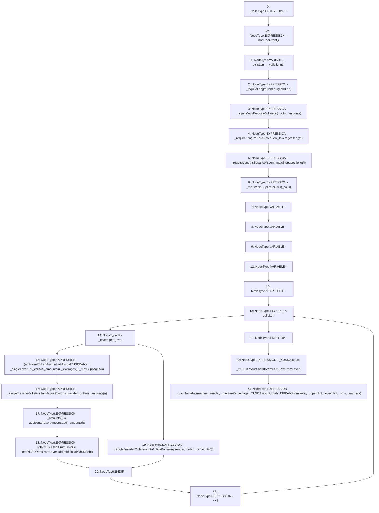

# Context: BorrowerOperations.openTroveLeverUp

**Contract:** `BorrowerOperations` (Inherits: ReentrancyGuard, IBorrowerOperations, CheckContract, Ownable, LiquityBase, YetiCustomBase, BaseMath, ILiquityBase)
**Signature:** `openTroveLeverUp(uint256,uint256,address,address,address[],uint256[],uint256[],uint256[])`
**Method Selector ID:** `0x2eb5c5e4`
**Visibility:** `external`
**Environment-Free:** `No (reads EVM state context)`
**Modifiers:**
- `nonReentrant`
  ```solidity
  modifier nonReentrant() {
          // On the first call to nonReentrant, _notEntered will be true
          require(_status != _ENTERED, "ReentrancyGuard: reentrant call");
  
          // Any calls to nonReentrant after this point will fail
          _status = _ENTERED;
  
          _;
  
          // By storing the original value once again, a refund is triggered (see
          // https://eips.ethereum.org/EIPS/eip-2200)
          _status = _NOT_ENTERED;
      }
  ```

### State Variables Interaction
- **Reads:** None
- **Writes:** None

### Environment & Verification Flags
- **Uses Foundry Cheatcodes:** No
- **Has Echidna Properties:** No

### Internal Calls Tree
- None

### External Calls / Value Transfers
- `SafeMath.TMP_147(uint256) = LIBRARY_CALL, dest:SafeMath, function:SafeMath.add(uint256,uint256), arguments:['additionalTokenAmount', 'REF_154'] `
- `SafeMath.TMP_150(uint256) = LIBRARY_CALL, dest:SafeMath, function:SafeMath.add(uint256,uint256), arguments:['_YUSDAmount', 'totalYUSDDebtFromLever'] `
- `SafeMath.TMP_148(uint256) = LIBRARY_CALL, dest:SafeMath, function:SafeMath.add(uint256,uint256), arguments:['totalYUSDDebtFromLever', 'additionalYUSDDebt'] `

### Control Flow Graph (CFG)


### Source Mapping
Declared in: `certora-ac-datasets/detasets/web3bugs/dataset/web3bugs/66/packages/contracts/contracts/BorrowerOperations.sol` on lines **261** to **311**

```solidity
    function openTroveLeverUp(
        uint256 _maxFeePercentage,
        uint256 _YUSDAmount,
        address _upperHint,
        address _lowerHint,
        address[] memory _colls,
        uint256[] memory _amounts, 
        uint256[] memory _leverages,
        uint256[] calldata _maxSlippages
    ) external override nonReentrant{
        uint256 collsLen = _colls.length;
        _requireLengthNonzero(collsLen);
        _requireValidDepositCollateral(_colls, _amounts);
        // Must check additional passed in arrays
        _requireLengthsEqual(collsLen, _leverages.length);
        _requireLengthsEqual(collsLen, _maxSlippages.length);
        _requireNoDuplicateColls(_colls);
        uint additionalTokenAmount;
        uint additionalYUSDDebt;
        uint totalYUSDDebtFromLever;
        for (uint256 i; i < collsLen; ++i) {
            if (_leverages[i] != 0) {
                (additionalTokenAmount, additionalYUSDDebt) = _singleLeverUp(
                    _colls[i],
                    _amounts[i],
                    _leverages[i],
                    _maxSlippages[i]
                );
                // Transfer into active pool, non levered amount. 
                _singleTransferCollateralIntoActivePool(msg.sender, _colls[i], _amounts[i]);
                // additional token amount was set to the original amount * leverage. 
                _amounts[i] = additionalTokenAmount.add(_amounts[i]);
                totalYUSDDebtFromLever = totalYUSDDebtFromLever.add(additionalYUSDDebt);
            } else {
                // Otherwise skip and do normal transfer that amount into active pool. 
                _singleTransferCollateralIntoActivePool(msg.sender, _colls[i], _amounts[i]);
            }
        }
        _YUSDAmount = _YUSDAmount.add(totalYUSDDebtFromLever);
        
        _openTroveInternal(
            msg.sender,
            _maxFeePercentage,
            _YUSDAmount,
            totalYUSDDebtFromLever,
            _upperHint,
            _lowerHint,
            _colls,
            _amounts
        );
    }

```
