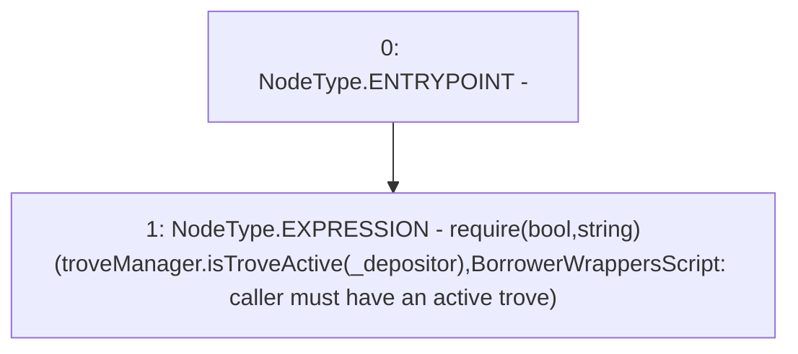

# Context: BorrowerWrappersScript._requireUserHasTrove

**Contract:** `BorrowerWrappersScript` (Inherits: SYETIScript, ETHTransferScript, BorrowerOperationsScript, CheckContract)
**Signature:** `_requireUserHasTrove(address)`
**Method Selector ID:** `Internal (No Method ID)`
**Visibility:** `internal`
**Environment-Free:** `Yes`
**Modifiers:** None

### State Variables Interaction
- **Reads:** troveManager
- **Writes:** None

### Assertion Checks & Business Requirements
- require/assert: `require(bool,string)(troveManager.isTroveActive(_depositor),BorrowerWrappersScript: caller must have an active trove)`

### Environment & Verification Flags
- **Uses Foundry Cheatcodes:** No
- **Has Echidna Properties:** No

### Internal Calls Tree
- None

### External Calls / Value Transfers
- `ITroveManager.TMP_103(bool) = HIGH_LEVEL_CALL, dest:troveManager(ITroveManager), function:isTroveActive, arguments:['_depositor']  `

### Control Flow Graph (CFG)


### Source Mapping
Declared in: `certora-ac-datasets/detasets/web3bugs/dataset/web3bugs/66/packages/contracts/contracts/Proxy/BorrowerWrappersScript.sol` on lines **153** to **155**

```solidity
    function _requireUserHasTrove(address _depositor) internal view {
        require(troveManager.isTroveActive(_depositor), "BorrowerWrappersScript: caller must have an active trove");
    }

```
