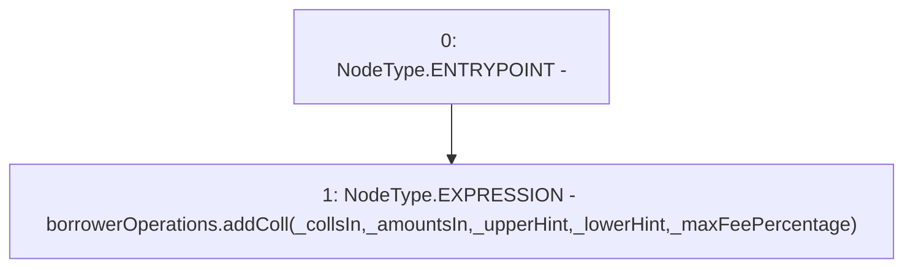

# Context: BorrowerWrappersScript.addColl

**Contract:** `BorrowerWrappersScript` (Inherits: SYETIScript, ETHTransferScript, BorrowerOperationsScript, CheckContract)
**Signature:** `addColl(address[],uint256[],address,address,uint256)`
**Method Selector ID:** `0xe63ce3c0`
**Visibility:** `external`
**Environment-Free:** `Yes`
**Modifiers:** None

### State Variables Interaction
- **Reads:** borrowerOperations
- **Writes:** None

### Environment & Verification Flags
- **Uses Foundry Cheatcodes:** No
- **Has Echidna Properties:** No

### Internal Calls Tree
- None

### External Calls / Value Transfers
- `IBorrowerOperations.HIGH_LEVEL_CALL, dest:borrowerOperations(IBorrowerOperations), function:addColl, arguments:['_collsIn', '_amountsIn', '_upperHint', '_lowerHint', '_maxFeePercentage']  `

### Control Flow Graph (CFG)


### Source Mapping
Declared in: `certora-ac-datasets/detasets/web3bugs/dataset/web3bugs/66/packages/contracts/contracts/Proxy/BorrowerOperationsScript.sol` on lines **27** to **29**

```solidity
    function addColl(address[] memory _collsIn, uint[] memory _amountsIn, address _upperHint, address _lowerHint, uint _maxFeePercentage) external payable {
borrowerOperations.addColl(_collsIn, _amountsIn, _upperHint, _lowerHint, _maxFeePercentage);
    }

```
