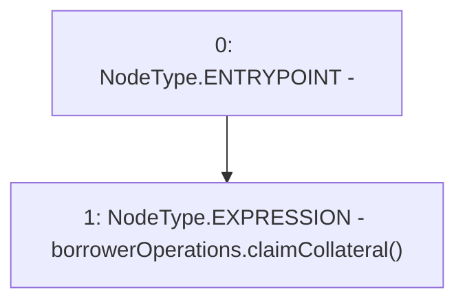

# Context: BorrowerWrappersScript.claimCollateral

**Contract:** `BorrowerWrappersScript` (Inherits: SYETIScript, ETHTransferScript, BorrowerOperationsScript, CheckContract)
**Signature:** `claimCollateral()`
**Method Selector ID:** `0x6f0b0c1c`
**Visibility:** `external`
**Environment-Free:** `Yes`
**Modifiers:** None

### State Variables Interaction
- **Reads:** borrowerOperations
- **Writes:** None

### Environment & Verification Flags
- **Uses Foundry Cheatcodes:** No
- **Has Echidna Properties:** No

### Internal Calls Tree
- None

### External Calls / Value Transfers
- `IBorrowerOperations.HIGH_LEVEL_CALL, dest:borrowerOperations(IBorrowerOperations), function:claimCollateral, arguments:[]  `

### Control Flow Graph (CFG)


### Source Mapping
Declared in: `certora-ac-datasets/detasets/web3bugs/dataset/web3bugs/66/packages/contracts/contracts/Proxy/BorrowerOperationsScript.sol` on lines **61** to **63**

```solidity
    function claimCollateral() external {
        borrowerOperations.claimCollateral();
    }

```
