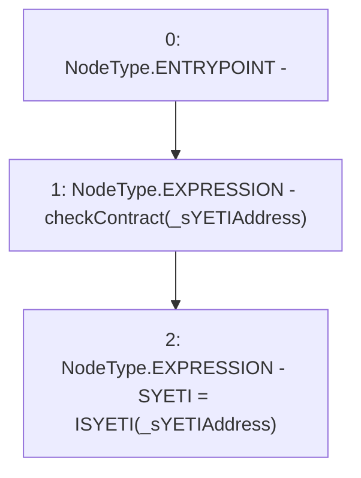

# Context: BorrowerWrappersScript.constructor

**Contract:** `BorrowerWrappersScript` (Inherits: SYETIScript, ETHTransferScript, BorrowerOperationsScript, CheckContract)
**Signature:** `constructor(address)`
**Method Selector ID:** `0xf8a6c595`
**Visibility:** `public`
**Environment-Free:** `Yes`
**Modifiers:** None

### State Variables Interaction
- **Reads:** None
- **Writes:** SYETI

### Environment & Verification Flags
- **Uses Foundry Cheatcodes:** No
- **Has Echidna Properties:** No

### Internal Calls Tree
- None

### External Calls / Value Transfers
- None

### Control Flow Graph (CFG)


### Source Mapping
Declared in: `certora-ac-datasets/detasets/web3bugs/dataset/web3bugs/66/packages/contracts/contracts/Proxy/SYETIScript.sol` on lines **12** to **15**

```solidity
    constructor(address _sYETIAddress) public {
        checkContract(_sYETIAddress);
        SYETI = ISYETI(_sYETIAddress);
    }

```
