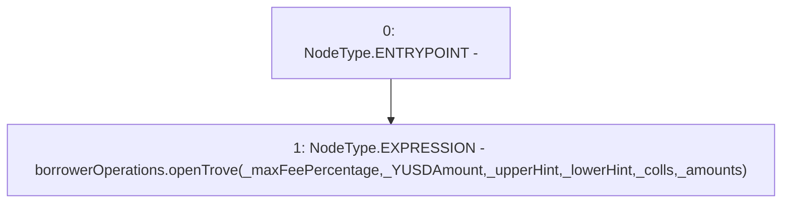

# Context: BorrowerWrappersScript.openTrove

**Contract:** `BorrowerWrappersScript` (Inherits: SYETIScript, ETHTransferScript, BorrowerOperationsScript, CheckContract)
**Signature:** `openTrove(uint256,uint256,address,address,address[],uint256[])`
**Method Selector ID:** `0xfe442cff`
**Visibility:** `external`
**Environment-Free:** `Yes`
**Modifiers:** None

### State Variables Interaction
- **Reads:** borrowerOperations
- **Writes:** None

### Environment & Verification Flags
- **Uses Foundry Cheatcodes:** No
- **Has Echidna Properties:** No

### Internal Calls Tree
- None

### External Calls / Value Transfers
- `IBorrowerOperations.HIGH_LEVEL_CALL, dest:borrowerOperations(IBorrowerOperations), function:openTrove, arguments:['_maxFeePercentage', '_YUSDAmount', '_upperHint', '_lowerHint', '_colls', '_amounts']  `

### Control Flow Graph (CFG)


### Source Mapping
Declared in: `certora-ac-datasets/detasets/web3bugs/dataset/web3bugs/66/packages/contracts/contracts/Proxy/BorrowerOperationsScript.sol` on lines **17** to **25**

```solidity
    function openTrove(uint _maxFeePercentage,
        uint _YUSDAmount,
        address _upperHint,
        address _lowerHint,
        address[] memory _colls,
        uint[] memory _amounts
        ) external payable {
        borrowerOperations.openTrove(_maxFeePercentage, _YUSDAmount, _upperHint,_lowerHint, _colls, _amounts);
    }

```
