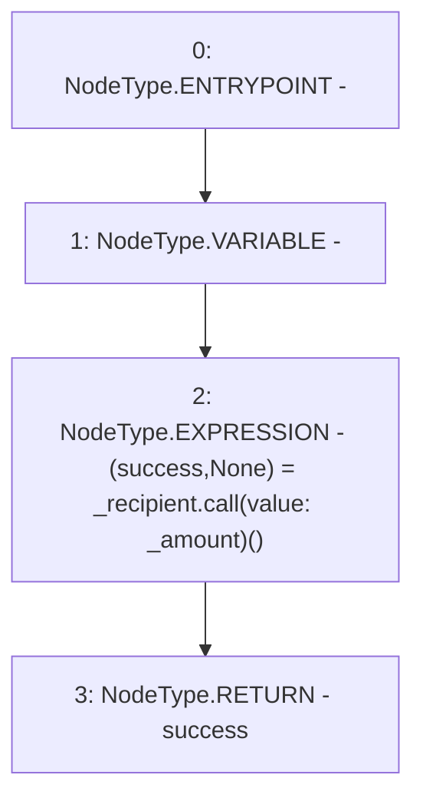

# Context: BorrowerWrappersScript.transferETH

**Contract:** `BorrowerWrappersScript` (Inherits: SYETIScript, ETHTransferScript, BorrowerOperationsScript, CheckContract)
**Signature:** `transferETH(address,uint256) returns (bool)`
**Method Selector ID:** `0x7b1a4909`
**Visibility:** `external`
**Environment-Free:** `Yes`
**Modifiers:** None

### State Variables Interaction
- **Reads:** None
- **Writes:** None

### Environment & Verification Flags
- **Uses Foundry Cheatcodes:** No
- **Has Echidna Properties:** No

### Internal Calls Tree
- None

### External Calls / Value Transfers
- `low-level-call`

### Control Flow Graph (CFG)


### Source Mapping
Declared in: `certora-ac-datasets/detasets/web3bugs/dataset/web3bugs/66/packages/contracts/contracts/Proxy/ETHTransferScript.sol` on lines **7** to **10**

```solidity
    function transferETH(address _recipient, uint256 _amount) external returns (bool) {
        (bool success, ) = _recipient.call{value: _amount}("");
        return success;
    }

```
