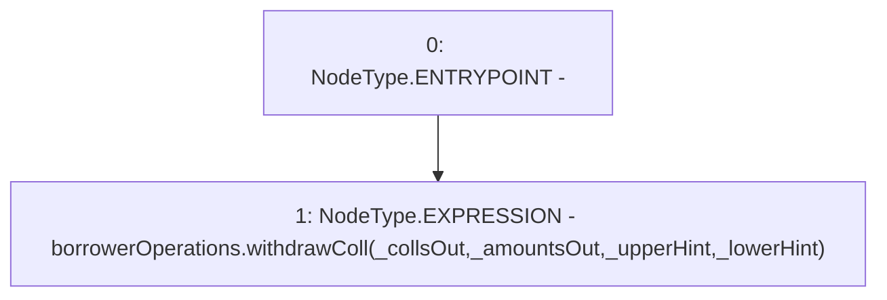

# Context: BorrowerWrappersScript.withdrawColl

**Contract:** `BorrowerWrappersScript` (Inherits: SYETIScript, ETHTransferScript, BorrowerOperationsScript, CheckContract)
**Signature:** `withdrawColl(address[],uint256[],address,address)`
**Method Selector ID:** `0x454a7efd`
**Visibility:** `external`
**Environment-Free:** `Yes`
**Modifiers:** None

### State Variables Interaction
- **Reads:** borrowerOperations
- **Writes:** None

### Environment & Verification Flags
- **Uses Foundry Cheatcodes:** No
- **Has Echidna Properties:** No

### Internal Calls Tree
- None

### External Calls / Value Transfers
- `IBorrowerOperations.HIGH_LEVEL_CALL, dest:borrowerOperations(IBorrowerOperations), function:withdrawColl, arguments:['_collsOut', '_amountsOut', '_upperHint', '_lowerHint']  `

### Control Flow Graph (CFG)


### Source Mapping
Declared in: `certora-ac-datasets/detasets/web3bugs/dataset/web3bugs/66/packages/contracts/contracts/Proxy/BorrowerOperationsScript.sol` on lines **31** to **33**

```solidity
    function withdrawColl(address[] memory _collsOut, uint[] memory _amountsOut, address _upperHint, address _lowerHint) external {
borrowerOperations.withdrawColl(_collsOut, _amountsOut, _upperHint, _lowerHint);
    }

```
