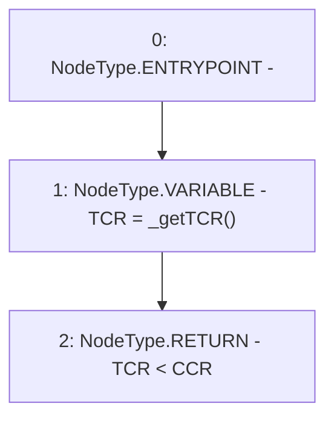

# Context: CollSurplusPool._checkRecoveryMode

**Contract:** `CollSurplusPool` (Inherits: LiquityBase, YetiCustomBase, BaseMath, ILiquityBase, ICollSurplusPool, ICollateralReceiver, CheckContract, Ownable)
**Signature:** `_checkRecoveryMode() returns (bool)`
**Method Selector ID:** `Internal (No Method ID)`
**Visibility:** `internal`
**Environment-Free:** `Yes`
**Modifiers:** None

### State Variables Interaction
- **Reads:** CCR
- **Writes:** None

### Environment & Verification Flags
- **Uses Foundry Cheatcodes:** No
- **Has Echidna Properties:** No

### Internal Calls Tree
- None

### External Calls / Value Transfers
- None

### Control Flow Graph (CFG)


### Source Mapping
Declared in: `certora-ac-datasets/detasets/web3bugs/dataset/web3bugs/66/packages/contracts/contracts/Dependencies/LiquityBase.sol` on lines **119** to **122**

```solidity
    function _checkRecoveryMode() internal view returns (bool) {
        uint TCR = _getTCR();
        return TCR < CCR;
    }

```
