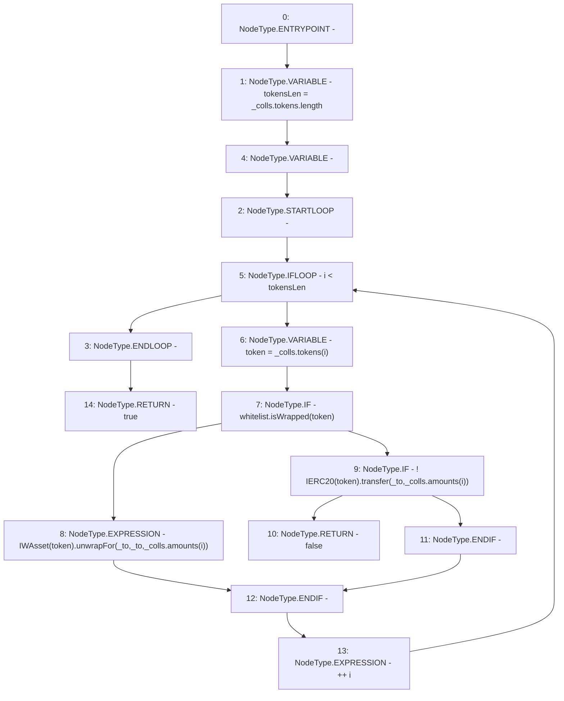

# Context: CollSurplusPool._sendColl

**Contract:** `CollSurplusPool` (Inherits: LiquityBase, YetiCustomBase, BaseMath, ILiquityBase, ICollSurplusPool, ICollateralReceiver, CheckContract, Ownable)
**Signature:** `_sendColl(address,YetiCustomBase.newColls) returns (bool)`
**Method Selector ID:** `Internal (No Method ID)`
**Visibility:** `internal`
**Environment-Free:** `Yes`
**Modifiers:** None

### State Variables Interaction
- **Reads:** whitelist
- **Writes:** None

### Environment & Verification Flags
- **Uses Foundry Cheatcodes:** No
- **Has Echidna Properties:** No

### Internal Calls Tree
- None

### External Calls / Value Transfers
- `IWhitelist.TMP_153(bool) = HIGH_LEVEL_CALL, dest:whitelist(IWhitelist), function:isWrapped, arguments:['token']  `
- `IWAsset.HIGH_LEVEL_CALL, dest:TMP_154(IWAsset), function:unwrapFor, arguments:['_to', '_to', 'REF_179']  `
- `IERC20.TMP_157(bool) = HIGH_LEVEL_CALL, dest:TMP_156(IERC20), function:transfer, arguments:['_to', 'REF_182']  `

### Control Flow Graph (CFG)


### Source Mapping
Declared in: `certora-ac-datasets/detasets/web3bugs/dataset/web3bugs/66/packages/contracts/contracts/CollSurplusPool.sol` on lines **197** to **213**

```solidity
    function _sendColl(address _to, newColls memory _colls) internal returns (bool) {
        uint256 tokensLen = _colls.tokens.length;
        for (uint256 i; i < tokensLen; ++i) {
            address token = _colls.tokens[i];
            if (whitelist.isWrapped(token)) {
                // Collects rewards automatically for that amount and unwraps for the original borrower. 
                // CSP actually owns these assets so it transfers it from this contract to the _to param. 
                IWAsset(token).unwrapFor(_to, _to, _colls.amounts[i]);
            } else {
                // Otherwise transfer like normal ERC20
                if (!IERC20(token).transfer(_to, _colls.amounts[i])) {
                    return false;
                }
            }
        }
        return true;
    }

```
