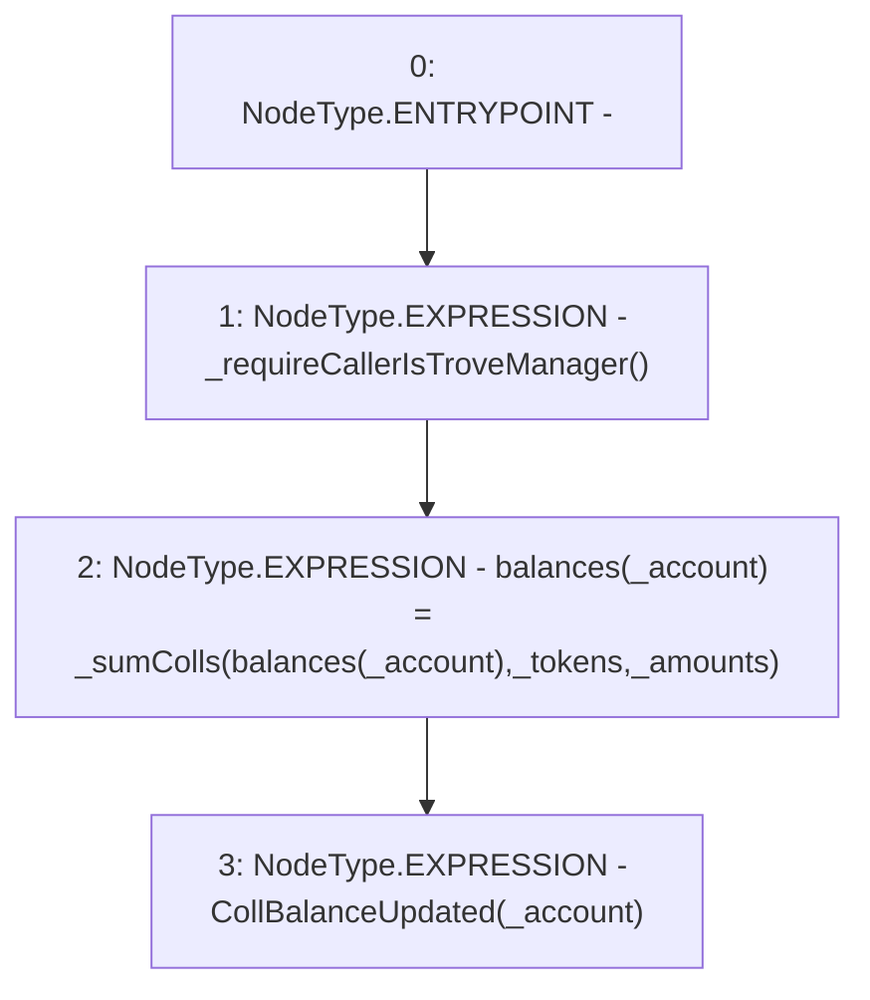

# Context: CollSurplusPool.accountSurplus

**Contract:** `CollSurplusPool` (Inherits: LiquityBase, YetiCustomBase, BaseMath, ILiquityBase, ICollSurplusPool, ICollateralReceiver, CheckContract, Ownable)
**Signature:** `accountSurplus(address,address[],uint256[])`
**Method Selector ID:** `0x9efc9e20`
**Visibility:** `external`
**Environment-Free:** `No (reads EVM state context)`
**Modifiers:** None

### State Variables Interaction
- **Reads:** balances
- **Writes:** balances

### Environment & Verification Flags
- **Uses Foundry Cheatcodes:** No
- **Has Echidna Properties:** No

### Internal Calls Tree
- None

### External Calls / Value Transfers
- None

### Control Flow Graph (CFG)


### Source Mapping
Declared in: `certora-ac-datasets/detasets/web3bugs/dataset/web3bugs/66/packages/contracts/contracts/CollSurplusPool.sol` on lines **120** to **128**

```solidity
    function accountSurplus(
        address _account,
        address[] memory _tokens,
        uint256[] memory _amounts
    ) external override {
        _requireCallerIsTroveManager();
        balances[_account] = _sumColls(balances[_account], _tokens, _amounts);
        emit CollBalanceUpdated(_account);
    }

```
