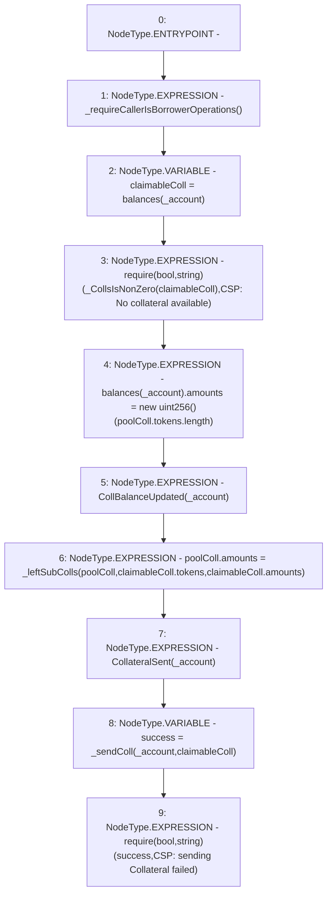

# Context: CollSurplusPool.claimColl

**Contract:** `CollSurplusPool` (Inherits: LiquityBase, YetiCustomBase, BaseMath, ILiquityBase, ICollSurplusPool, ICollateralReceiver, CheckContract, Ownable)
**Signature:** `claimColl(address)`
**Method Selector ID:** `0xb32beb5b`
**Visibility:** `external`
**Environment-Free:** `No (reads EVM state context)`
**Modifiers:** None

### State Variables Interaction
- **Reads:** balances, poolColl
- **Writes:** balances, poolColl

### Assertion Checks & Business Requirements
- require/assert: `require(bool,string)(_CollsIsNonZero(claimableColl),CSP: No collateral available)`
- require/assert: `require(bool,string)(success,CSP: sending Collateral failed)`

### Environment & Verification Flags
- **Uses Foundry Cheatcodes:** No
- **Has Echidna Properties:** No

### Internal Calls Tree
- None

### External Calls / Value Transfers
- `TMP_130(None) = SOLIDITY_CALL require(bool,string)(success,CSP: sending Collateral failed)`

### Control Flow Graph (CFG)


### Source Mapping
Declared in: `certora-ac-datasets/detasets/web3bugs/dataset/web3bugs/66/packages/contracts/contracts/CollSurplusPool.sol` on lines **132** to **146**

```solidity
    function claimColl(address _account) external override {
        _requireCallerIsBorrowerOperations();

        newColls memory claimableColl = balances[_account];
        require(_CollsIsNonZero(claimableColl), "CSP: No collateral available");

        balances[_account].amounts = new uint256[](poolColl.tokens.length); // sets balance of account to 0
        emit CollBalanceUpdated(_account);

        poolColl.amounts = _leftSubColls(poolColl, claimableColl.tokens, claimableColl.amounts);
        emit CollateralSent(_account);

        bool success = _sendColl(_account, claimableColl);
        require(success, "CSP: sending Collateral failed");
    }

```
