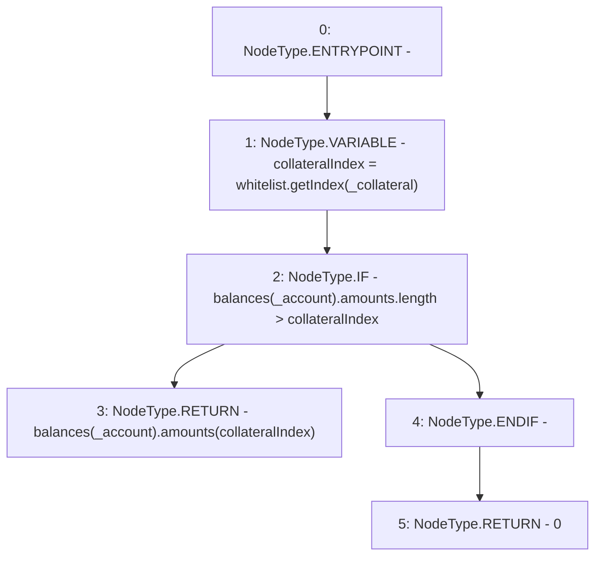

# Context: CollSurplusPool.getAmountClaimable

**Contract:** `CollSurplusPool` (Inherits: LiquityBase, YetiCustomBase, BaseMath, ILiquityBase, ICollSurplusPool, ICollateralReceiver, CheckContract, Ownable)
**Signature:** `getAmountClaimable(address,address) returns (uint256)`
**Method Selector ID:** `0x61721554`
**Visibility:** `external`
**Environment-Free:** `Yes`
**Modifiers:** None

### State Variables Interaction
- **Reads:** balances, whitelist
- **Writes:** None

### Environment & Verification Flags
- **Uses Foundry Cheatcodes:** No
- **Has Echidna Properties:** No

### Internal Calls Tree
- None

### External Calls / Value Transfers
- `IWhitelist.TMP_115(uint256) = HIGH_LEVEL_CALL, dest:whitelist(IWhitelist), function:getIndex, arguments:['_collateral']  `

### Control Flow Graph (CFG)


### Source Mapping
Declared in: `certora-ac-datasets/detasets/web3bugs/dataset/web3bugs/66/packages/contracts/contracts/CollSurplusPool.sol` on lines **86** to **97**

```solidity
    function getAmountClaimable(address _account, address _collateral)
        external
        view
        override
        returns (uint256)
    {
        uint256 collateralIndex = whitelist.getIndex(_collateral);
        if (balances[_account].amounts.length > collateralIndex) {
            return balances[_account].amounts[collateralIndex];
        }
        return 0;
    }

```
