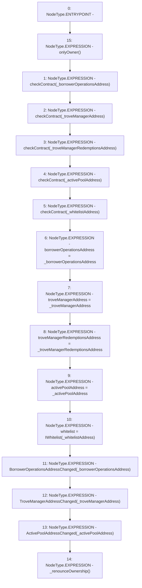

# Context: CollSurplusPool.setAddresses

**Contract:** `CollSurplusPool` (Inherits: LiquityBase, YetiCustomBase, BaseMath, ILiquityBase, ICollSurplusPool, ICollateralReceiver, CheckContract, Ownable)
**Signature:** `setAddresses(address,address,address,address,address)`
**Method Selector ID:** `0x5dd68acd`
**Visibility:** `external`
**Environment-Free:** `No (reads EVM state context)`
**Modifiers:**
- `onlyOwner`
  ```solidity
  modifier onlyOwner() {
          require(isOwner(), "CallerNotOwner");
          _;
      }
  ```

### State Variables Interaction
- **Reads:** None
- **Writes:** activePoolAddress, borrowerOperationsAddress, troveManagerAddress, troveManagerRedemptionsAddress, whitelist

### Environment & Verification Flags
- **Uses Foundry Cheatcodes:** No
- **Has Echidna Properties:** No

### Internal Calls Tree
- None

### External Calls / Value Transfers
- None

### Control Flow Graph (CFG)


### Source Mapping
Declared in: `certora-ac-datasets/detasets/web3bugs/dataset/web3bugs/66/packages/contracts/contracts/CollSurplusPool.sol` on lines **45** to **69**

```solidity
    function setAddresses(
        address _borrowerOperationsAddress,
        address _troveManagerAddress,
        address _troveManagerRedemptionsAddress,
        address _activePoolAddress,
        address _whitelistAddress
    ) external override onlyOwner {
        checkContract(_borrowerOperationsAddress);
        checkContract(_troveManagerAddress);
        checkContract(_troveManagerRedemptionsAddress);
        checkContract(_activePoolAddress);
        checkContract(_whitelistAddress);

        borrowerOperationsAddress = _borrowerOperationsAddress;
        troveManagerAddress = _troveManagerAddress;
        troveManagerRedemptionsAddress = _troveManagerRedemptionsAddress;
        activePoolAddress = _activePoolAddress;
        whitelist = IWhitelist(_whitelistAddress);

        emit BorrowerOperationsAddressChanged(_borrowerOperationsAddress);
        emit TroveManagerAddressChanged(_troveManagerAddress);
        emit ActivePoolAddressChanged(_activePoolAddress);

        _renounceOwnership();
    }

```
