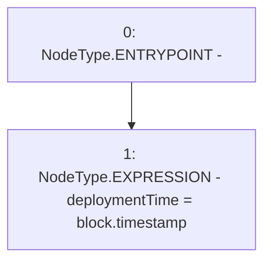

# Context: CommunityIssuanceTester.constructor

**Contract:** `CommunityIssuanceTester` (Inherits: CommunityIssuance, BaseMath, CheckContract, Ownable, ICommunityIssuance)
**Signature:** `constructor()`
**Method Selector ID:** `0x90fa17bb`
**Visibility:** `public`
**Environment-Free:** `No (reads EVM state context)`
**Modifiers:** None

### State Variables Interaction
- **Reads:** None
- **Writes:** deploymentTime

### Environment & Verification Flags
- **Uses Foundry Cheatcodes:** No
- **Has Echidna Properties:** No

### Internal Calls Tree
- None

### External Calls / Value Transfers
- None

### Control Flow Graph (CFG)


### Source Mapping
Declared in: `certora-ac-datasets/detasets/web3bugs/dataset/web3bugs/66/packages/contracts/contracts/YETI/CommunityIssuance.sol` on lines **64** to **66**

```solidity
    constructor() public {
        deploymentTime = block.timestamp;
    }

```
