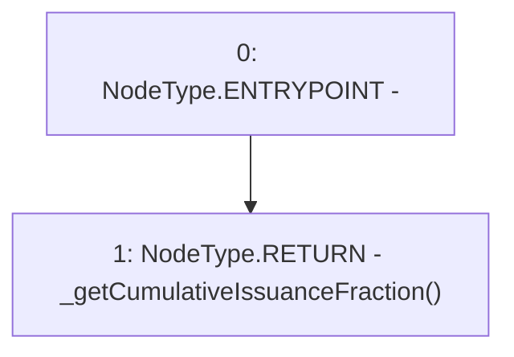

# Context: CommunityIssuanceTester.getCumulativeIssuanceFraction

**Contract:** `CommunityIssuanceTester` (Inherits: CommunityIssuance, BaseMath, CheckContract, Ownable, ICommunityIssuance)
**Signature:** `getCumulativeIssuanceFraction() returns (uint256)`
**Method Selector ID:** `0x9d5b044d`
**Visibility:** `external`
**Environment-Free:** `No (reads EVM state context)`
**Modifiers:** None

### State Variables Interaction
- **Reads:** None
- **Writes:** None

### Environment & Verification Flags
- **Uses Foundry Cheatcodes:** No
- **Has Echidna Properties:** No

### Internal Calls Tree
- None

### External Calls / Value Transfers
- None

### Control Flow Graph (CFG)


### Source Mapping
Declared in: `certora-ac-datasets/detasets/web3bugs/dataset/web3bugs/66/packages/contracts/contracts/TestContracts/CommunityIssuanceTester.sol` on lines **12** to **14**

```solidity
    function getCumulativeIssuanceFraction() external view returns (uint) {
       return _getCumulativeIssuanceFraction();
    }

```
