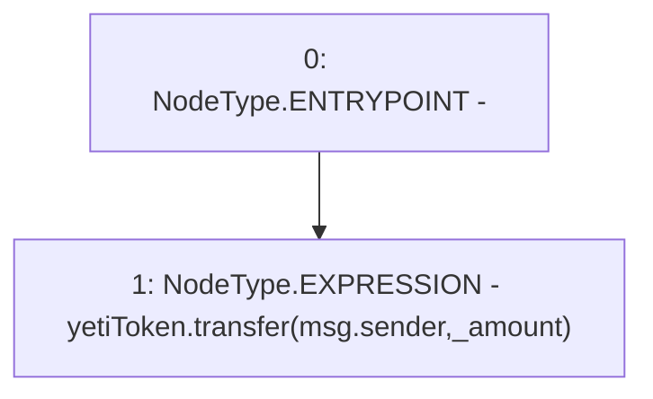

# Context: CommunityIssuanceTester.obtainYETI

**Contract:** `CommunityIssuanceTester` (Inherits: CommunityIssuance, BaseMath, CheckContract, Ownable, ICommunityIssuance)
**Signature:** `obtainYETI(uint256)`
**Method Selector ID:** `0x0af3aa59`
**Visibility:** `external`
**Environment-Free:** `No (reads EVM state context)`
**Modifiers:** None

### State Variables Interaction
- **Reads:** yetiToken
- **Writes:** None

### Environment & Verification Flags
- **Uses Foundry Cheatcodes:** No
- **Has Echidna Properties:** No

### Internal Calls Tree
- None

### External Calls / Value Transfers
- `IYETIToken.TMP_155(bool) = HIGH_LEVEL_CALL, dest:yetiToken(IYETIToken), function:transfer, arguments:['msg.sender', '_amount']  `

### Control Flow Graph (CFG)


### Source Mapping
Declared in: `certora-ac-datasets/detasets/web3bugs/dataset/web3bugs/66/packages/contracts/contracts/TestContracts/CommunityIssuanceTester.sol` on lines **8** to **10**

```solidity
    function obtainYETI(uint _amount) external {
        yetiToken.transfer(msg.sender, _amount);
    }

```
