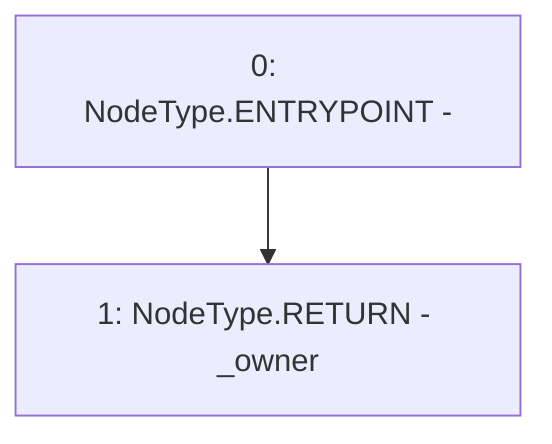

# Context: CommunityIssuanceTester.owner

**Contract:** `CommunityIssuanceTester` (Inherits: CommunityIssuance, BaseMath, CheckContract, Ownable, ICommunityIssuance)
**Signature:** `owner() returns (address)`
**Method Selector ID:** `0x8da5cb5b`
**Visibility:** `public`
**Environment-Free:** `Yes`
**Modifiers:** None

### State Variables Interaction
- **Reads:** _owner
- **Writes:** None

### Environment & Verification Flags
- **Uses Foundry Cheatcodes:** No
- **Has Echidna Properties:** No

### Internal Calls Tree
- None

### External Calls / Value Transfers
- None

### Control Flow Graph (CFG)


### Source Mapping
Declared in: `certora-ac-datasets/detasets/web3bugs/dataset/web3bugs/66/packages/contracts/contracts/Dependencies/Ownable.sol` on lines **33** to **35**

```solidity
    function owner() public view returns (address) {
        return _owner;
    }

```
