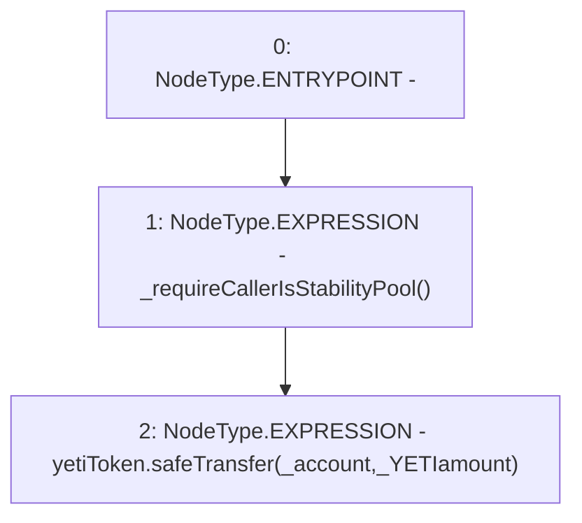

# Context: CommunityIssuanceTester.sendYETI

**Contract:** `CommunityIssuanceTester` (Inherits: CommunityIssuance, BaseMath, CheckContract, Ownable, ICommunityIssuance)
**Signature:** `sendYETI(address,uint256)`
**Method Selector ID:** `0x86ec04e6`
**Visibility:** `external`
**Environment-Free:** `No (reads EVM state context)`
**Modifiers:** None

### State Variables Interaction
- **Reads:** yetiToken
- **Writes:** None

### Environment & Verification Flags
- **Uses Foundry Cheatcodes:** No
- **Has Echidna Properties:** No

### Internal Calls Tree
- None

### External Calls / Value Transfers
- `SafeERC20.LIBRARY_CALL, dest:SafeERC20, function:SafeERC20.safeTransfer(IERC20,address,uint256), arguments:['yetiToken', '_account', '_YETIamount'] `

### Control Flow Graph (CFG)


### Source Mapping
Declared in: `certora-ac-datasets/detasets/web3bugs/dataset/web3bugs/66/packages/contracts/contracts/YETI/CommunityIssuance.sol` on lines **123** to **127**

```solidity
    function sendYETI(address _account, uint _YETIamount) external override {
        _requireCallerIsStabilityPool();

        yetiToken.safeTransfer(_account, _YETIamount);
    }

```
