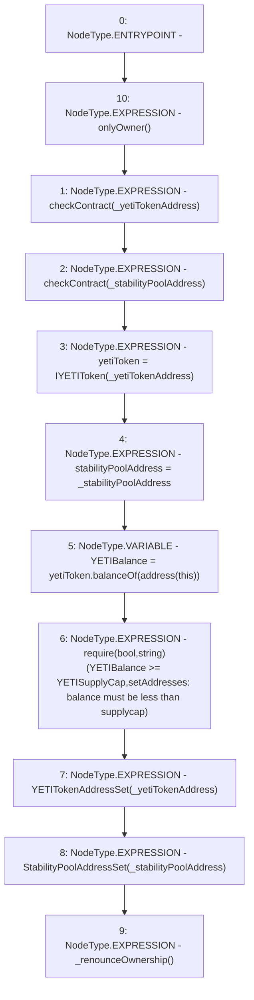

# Context: CommunityIssuanceTester.setAddresses

**Contract:** `CommunityIssuanceTester` (Inherits: CommunityIssuance, BaseMath, CheckContract, Ownable, ICommunityIssuance)
**Signature:** `setAddresses(address,address)`
**Method Selector ID:** `0x90107afe`
**Visibility:** `external`
**Environment-Free:** `No (reads EVM state context)`
**Modifiers:**
- `onlyOwner`
  ```solidity
  modifier onlyOwner() {
          require(isOwner(), "CallerNotOwner");
          _;
      }
  ```

### State Variables Interaction
- **Reads:** YETISupplyCap, yetiToken
- **Writes:** stabilityPoolAddress, yetiToken

### Assertion Checks & Business Requirements
- require/assert: `require(bool,string)(YETIBalance >= YETISupplyCap,setAddresses: balance must be less than supplycap)`

### Environment & Verification Flags
- **Uses Foundry Cheatcodes:** No
- **Has Echidna Properties:** No

### Internal Calls Tree
- None

### External Calls / Value Transfers
- `IYETIToken.TMP_120(uint256) = HIGH_LEVEL_CALL, dest:yetiToken(IYETIToken), function:balanceOf, arguments:['TMP_119']  `

### Control Flow Graph (CFG)


### Source Mapping
Declared in: `certora-ac-datasets/detasets/web3bugs/dataset/web3bugs/66/packages/contracts/contracts/YETI/CommunityIssuance.sol` on lines **68** to **91**

```solidity
    function setAddresses
    (
        address _yetiTokenAddress,
        address _stabilityPoolAddress
    ) 
        external 
        onlyOwner 
        override 
    {
        checkContract(_yetiTokenAddress);
        checkContract(_stabilityPoolAddress);

        yetiToken = IYETIToken(_yetiTokenAddress);
        stabilityPoolAddress = _stabilityPoolAddress;

        // When YETIToken deployed, it should have transferred CommunityIssuance's YETI entitlement
        uint YETIBalance = yetiToken.balanceOf(address(this));
        require(YETIBalance >= YETISupplyCap, "setAddresses: balance must be less than supplycap");

        emit YETITokenAddressSet(_yetiTokenAddress);
        emit StabilityPoolAddressSet(_stabilityPoolAddress);

        _renounceOwnership();
    }

```
