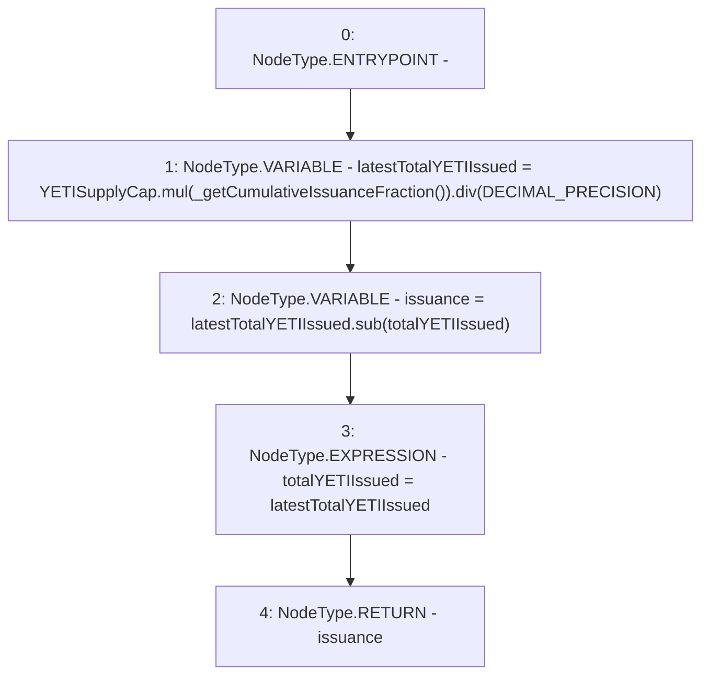

# Context: CommunityIssuanceTester.unprotectedIssueYETI

**Contract:** `CommunityIssuanceTester` (Inherits: CommunityIssuance, BaseMath, CheckContract, Ownable, ICommunityIssuance)
**Signature:** `unprotectedIssueYETI() returns (uint256)`
**Method Selector ID:** `0xa17a627e`
**Visibility:** `external`
**Environment-Free:** `No (reads EVM state context)`
**Modifiers:** None

### State Variables Interaction
- **Reads:** DECIMAL_PRECISION, YETISupplyCap, totalYETIIssued
- **Writes:** totalYETIIssued

### Environment & Verification Flags
- **Uses Foundry Cheatcodes:** No
- **Has Echidna Properties:** No

### Internal Calls Tree
- None

### External Calls / Value Transfers
- `SafeMath.TMP_158(uint256) = LIBRARY_CALL, dest:SafeMath, function:SafeMath.mul(uint256,uint256), arguments:['YETISupplyCap', 'TMP_157'] `
- `SafeMath.TMP_160(uint256) = LIBRARY_CALL, dest:SafeMath, function:SafeMath.sub(uint256,uint256), arguments:['latestTotalYETIIssued', 'totalYETIIssued'] `
- `SafeMath.TMP_159(uint256) = LIBRARY_CALL, dest:SafeMath, function:SafeMath.div(uint256,uint256), arguments:['TMP_158', 'DECIMAL_PRECISION'] `

### Control Flow Graph (CFG)


### Source Mapping
Declared in: `certora-ac-datasets/detasets/web3bugs/dataset/web3bugs/66/packages/contracts/contracts/TestContracts/CommunityIssuanceTester.sol` on lines **16** to **24**

```solidity
    function unprotectedIssueYETI() external returns (uint) {
        // No checks on caller address
       
        uint latestTotalYETIIssued = YETISupplyCap.mul(_getCumulativeIssuanceFraction()).div(DECIMAL_PRECISION);
        uint issuance = latestTotalYETIIssued.sub(totalYETIIssued);
      
        totalYETIIssued = latestTotalYETIIssued;
        return issuance;
    }

```
