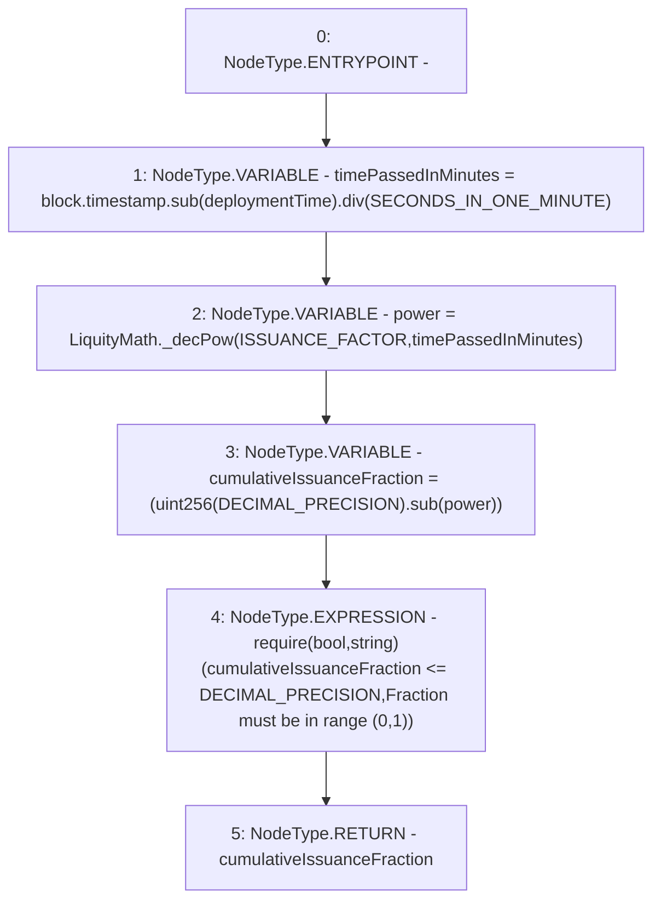

# Context: CommunityIssuance._getCumulativeIssuanceFraction

**Contract:** `CommunityIssuance` (Inherits: BaseMath, CheckContract, Ownable, ICommunityIssuance)
**Signature:** `_getCumulativeIssuanceFraction() returns (uint256)`
**Method Selector ID:** `Internal (No Method ID)`
**Visibility:** `internal`
**Environment-Free:** `No (reads EVM state context)`
**Modifiers:** None

### State Variables Interaction
- **Reads:** DECIMAL_PRECISION, ISSUANCE_FACTOR, SECONDS_IN_ONE_MINUTE, deploymentTime
- **Writes:** None

### Assertion Checks & Business Requirements
- require/assert: `require(bool,string)(cumulativeIssuanceFraction <= DECIMAL_PRECISION,Fraction must be in range [0,1])`

### Environment & Verification Flags
- **Uses Foundry Cheatcodes:** No
- **Has Echidna Properties:** No

### Internal Calls Tree
- None

### External Calls / Value Transfers
- `SafeMath.TMP_148(uint256) = LIBRARY_CALL, dest:SafeMath, function:SafeMath.sub(uint256,uint256), arguments:['TMP_147', 'power'] `
- `LiquityMath.TMP_146(uint256) = LIBRARY_CALL, dest:LiquityMath, function:LiquityMath._decPow(uint256,uint256), arguments:['ISSUANCE_FACTOR', 'timePassedInMinutes'] `
- `SafeMath.TMP_145(uint256) = LIBRARY_CALL, dest:SafeMath, function:SafeMath.div(uint256,uint256), arguments:['TMP_144', 'SECONDS_IN_ONE_MINUTE'] `
- `SafeMath.TMP_144(uint256) = LIBRARY_CALL, dest:SafeMath, function:SafeMath.sub(uint256,uint256), arguments:['block.timestamp', 'deploymentTime'] `

### Control Flow Graph (CFG)


### Source Mapping
Declared in: `certora-ac-datasets/detasets/web3bugs/dataset/web3bugs/66/packages/contracts/contracts/YETI/CommunityIssuance.sol` on lines **109** to **121**

```solidity
    function _getCumulativeIssuanceFraction() internal view returns (uint) {
        // Get the time passed since deployment
        uint timePassedInMinutes = block.timestamp.sub(deploymentTime).div(SECONDS_IN_ONE_MINUTE);

        // f^t
        uint power = LiquityMath._decPow(ISSUANCE_FACTOR, timePassedInMinutes);

        //  (1 - f^t)
        uint cumulativeIssuanceFraction = (uint(DECIMAL_PRECISION).sub(power));
        require(cumulativeIssuanceFraction <= DECIMAL_PRECISION, "Fraction must be in range [0,1]"); // must be in range [0,1]

        return cumulativeIssuanceFraction;
    }

```
